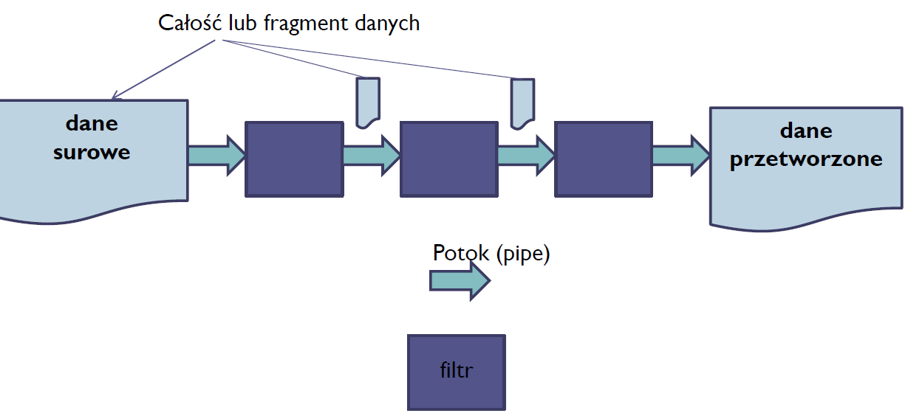

# Co trzeba umieć do projektu

- Założenia systemu 	
  - 1                                     MP

- Interesariusze (ich cele oraz zadania)
  - 2                                     JK

- Przypadki użycia (główne oraz alternatywne)
  - 2                                    KKP

- Podstawowy scenariusz
  - 2                                    KKP

- 4+1 Views (logical, development, use case, process, physical)
  - logical 				5          KKP  
  - development     3          AG
  - use case              4         JK
  - process               7         AG
  - physical               4         JK   

- Kluczowe wzorce architektoniczne i taktyki  + MAD 2.0 - decyzje architektoniczne       9             MP

# Wykład - istotne rzeczy niebezpośrednio proj

**Architektura** - organizacja (jak coś jest zorganizowane) systemu IT zawarta w komponentach, ich wzajemnych relacjach oraz ich relacjach ze środowiskiem (env). Architektura obejmuje też zasady projektowania i ewolucji systemu IT.

**interesariusz systemu IT** (system stakeholder) - osoba, zespół, organizacja, która ma wpływ lub pozostaje pod wpływem systemu IT. Interesariusze mają określone **zainteresowanie** (concern) związane z systemem.

**widok** - reprezentacja (całego) systemu IT z punktu widzenia pewnego zbioru zainteresowań

**Punkt widzenia** (viewpoint) - ): specyfikacja konwencji tworzenia i używania widoków. Wzorzec lub szablon określający jak tworzyć pojedyncze widoki. Obejmuje cel i grupę docelową widoku oraz techniki tworzenia i analizy.

## Metody projektowania

### ADD - Attribute-Driven Design

Autor: Rob Wojcik SEI (Carnegie Mellon)

Projektowanie architektury rozpoczyna się po wstępnej analizie wymagań. Należy zidentyfikować czynniki kształtujące architekturę architectural drivers ) kluczowe wymagania funkcjonalne, jakościowe i biznesowe

### RUP 4+1 Views

Robimy albo:

- kaskadowo - zaczynamy od jednego widoku np. scenariusze i potem po kolei reszta i w między czasie uzupełniamy spójność z innymi
- bottom-up - równolegle wszystko

# Interesariusze

**interesariusz systemu IT** (system stakeholder) - osoba, zespół, organizacja, która ma wpływ lub pozostaje pod wpływem systemu IT. Interesariusze mają określone **zainteresowanie** (concern) związane z systemem.

### Przykładowi interesariusze

- klient
- user
- właściciel
- sponsor
- operator
- architekt
- deweloper
- dostawca
- administrator (czym się różni od operatora???)

### Przykłady ich zainteresowań (concers)

- użytkowność
- ergonomia
- koszt wytworzenia/użytkowania
- niezawodność
- cele biznesowe i strategia biznesowa
- zgodność z prawem i regulacjami
- zwinność (co to???)
- złożoność
- wartość biznesowa (znowu???)

# 4+1 Views

**widok** - reprezentacja (całego) systemu IT z punktu widzenia pewnego zbioru zainteresowań

**Punkt widzenia** (viewpoint) - ): specyfikacja konwencji tworzenia i używania widoków. Wzorzec lub szablon określający jak tworzyć pojedyncze widoki. Obejmuje cel i grupę docelową widoku oraz techniki tworzenia i analizy.

**Przkładowe punkty widzenia**

- struktura apki
- funkcje biznesowe
- cele biznesowe
- komponenty i konektory
- decyzje
- infrastruktura
- wydajność
- procesory
- wymagania

### PKW example

PKW - Państwowa Komisja Wyborcza

TKW - Terenowa Komisja Wyborcza

# Wzorce arch. oraz taktyki arch.

**Wzorzec architektoniczny** - konfigurowalny wzorzec struktur systemów IT. Wzorce rozpatruje się w kontekście tzw. widoków. Widok reprezentuje architekturę z punktu widzenia pewnego wybranego aspektu strukturalnego:

- poziomy abstrakcji
- przepływ danych
- przechowywanie danych
- środowisko wykonawcze
- interakcja z userem
- komunikacja między komponentami
- rozmieszczenie komponentów

Opis wzorca to trójka:

- kontekst
- problem (jakiś co często się zdarza)
- rozwiązanie

### Widok poziomów abstrakcji

Wzorce:

- warstwy
- middleware

##### Warstwy

Podział systemu na niezależne fragmenty, rozwijane też niezależnie. Mogą być dostarczane przez różne podmioty. 

---> Zwiększenie przenośności, modyfikowalności i ponownego użycia.

Wady: jak każdego pośrednika - wnosi swój narzut. Budowa warstwowa "od zera" jest bardziej kosztowna.

np. OSI

> kurwa nie podoba mi się ten wykład, on ma ten przedmiot w chuju chyba xd
>
> gdzie omówienie MIDDLEWARE???

### Widok przepływu danych

Wzorce:

- potoki (pipes) i filtry
- sekwencyjne przetwarzanie wsadowe
- procesy biznesowe (vide zajęcia z SOA i procesów) przepływ danych bez narzuconej struktury

##### Potoki i filtry

Each filter exposes a very simple interface: it receives messages on the inbound pipe, processes the message, and publishes the results to the outbound pipe. The pipe connects one filter to the next, sending output messages from one filter to the next. Because all component use the same external interface they can be *composed* into different solutions by connecting the components to different pipes. We can add new filters, omit existing ones or rearrange them into a new sequence -- all without having to change the filters themselves. The connection between filter and pipe is sometimes called *port*. In the basic form, each filter component has one input port and one output port.

https://www.enterpriseintegrationpatterns.com/patterns/messaging/

##### Sekwencyjne przetwarzanie wsadowe

Wsadowe wywołania do usługi zdalnej to dobrze znana strategia zwiększania wydajności i skalowalności. Istnieją stałe koszty przetwarzania dla wszelkich interakcji z usługą zdalną, takich jak serializacja, transfer sieciowy i deserializacja. Pakowanie wielu oddzielnych transakcji w jednej partii minimalizuje te koszty.

### Widok przechowywania danych

Wzorce:

- Współdzielone repozytorium
- Aktywne Repozytorium
- Tablica (ang. blackboard)

##### Współdzielone repozytorium

przykład:

- baza danych
- zbiór plików z kodem w VCS

często realizowane jako klient-serwer

##### Aktywne repozytorium

Repozytorium informuje wszystkich korzystających o pojawieniu się nowych danych lub ich zmianie

##### Blackboard

Odmiana aktywnego repozytorium, gdzie korzystający zapisują się na dane i są o nich informowani. Czyli dają suba na konkretne dane i tylko o nich dostają notify'ie.

### Widok abstrakcji od sprzętu / Widok środowiska wykonawcznego

- Interpreter
- Maszyna Wirtualna
- Systemy regułowe

##### Interpter 

To chyba tak jak Python ma interpreter.

##### Maszyna Wirtualna

To chyba tak jak Java ma JVM.

##### Systemy regułowe

To chyba nie będzie mi nigdy dane sie dowiedzieć :cry:

### Widok interakcji z użytkownikiem

Wzorce:

- Model View Controller
- Prezentacja Abstrakcja Sterownik

##### Model-View-Controller

MVC i wszelkie rozszerzenia. Znany i lubiany.

Problem jaki rozwiązuje:

Jak odseparować UI od logiki biznesowej zachowując możliwość reagowania na działania usera i/lub zmiany danych, na których oprogramowanie działa.

##### Prezentacja-Abstracja-Sterownik

http://kurs.aspnetmvc.pl/Wzorce/PAC

https://en.wikipedia.org/wiki/Presentation%E2%80%93abstraction%E2%80%93control

### Widok komunikacji między komponentami

Wzorce:

- wywołanie bezpośrednie (w programie)
- wywołanie zdalnej procedury (umiejscowionej gdzieś w sieci)
- wywołanie pośrednie (przez zdarzenie)
  - broker
  - publikuj - zarejestruj się (zgłoś się)
  - kolejkowanie wiadomości
  - magistrala
- klient - serwer
- peer-to-peer 

##### Broker

Jak w MQTT

**Broker** -de facto jest odmianą middleware

- nie komunikujemy się bezpośrednio z adresatem komunikatu
- ujednolica sposób wymiany informacji narzucając własny standard interfejsu i formatu przekazywania danych - wystarczy znać format broker nie trzeba znać każdego systemu z osobna

Problem jaki rozwiązuje:

Jak wyeliminować konieczność ich lokalizacji, szczegółów umiejscowienia i dostępu do systemów usługodawców? (Jak SCP w 5G)

Jak zminimalizować liczbę protokołów komunikacyjnych, które musi znać usługobiorca korzystający z usług zewnętrznych? (Jak HTTP w 5G)

##### Magistrala

### Widok rozmieszczenia komponentów

# MAD 2.0 - decyzje architektoniczne

Czynniki wpływające na architekturę:

### Atrybuty jakościowe

- modyfikowalność/konserwowalność
- wydajność
- niezawodność
- bezpieczeństwo
- ergonomia
- interoperacyjność
- ponowne użycie komponentów
- time-to-market (kontrolowalność xd)

# Kurewsko potężny opis

System zarządzania logistyką przesyłek dla poczty/firmy kurierskiej. 

Zarządzanie przesyłkami, transportami i śledzenie przesyłek.

Odbiorca/Nadawca:

- Adres
- Nr tel
- Imię i Nazwisko 

User:

- email
- czy ma premium
- dane odbiorcy/nadawcy może sobie wypełnić

Jeśli mamy konto w apce to na dany email możemy uzupełniać automatycznie dane. 

Transakcja:

- id z którego da się wyciągnąć odbiorcę i nadawcę

- status 
  - paczka oczekuje w domu usera na odbiór przez kuriera
  - kurier podejmuje próbę odbioru
  - kurier odebrał paczkę i jeździ sobie ona z nim aż wieczorem zajedzie do oddziału
  - paczka jest w oddziale 1st-hop 
  - (routing po oddziałach jest robiony)
  - paczka jest w oddziale last-hop
  - paczka opuszcza wraz z kurierem oddział (last-hop) i jest u niego na pace, czyli kurier podejmuje próbę dostarczenia
  - paczka dostarczona
- kiedy kurier może odebrać paczkę od nadawcy

Firma nasza pozwala nadawcy wysłać paczkę do odbiorcy zdefiniowanego jako trójka wyżej. Usługa skierowana jest wyłącznie do osób prywatnych. Wszelkie optymalizacje robione są w tym kierunku. A hasło przewodni to "Klient nasz Pan, kurier to pies". Firma działa w modelu subskrypcji miesięcznej. Target to ludzie co wysyłają często paczki. Sub jest opcjonalny. Jak ktoś ma suba to jest nazywany User Premium. Userzy premium nie płacą za pojedyncze wysłanie paczki. 

Jak wygląda proces wysłania paczki (całościowy)?

Nadawca poprzez aplikacje web wypełnia informacje o odbiorcy (adres, nr tel, imie i nazwisko) (po podaniu e-mail odbiorcy jeśli ten ma konto w serwisie to te dane zaciągają się automatycznie) i o samej paczce (rozmiar (mała, duża, średnia), czy fragile) i o priorytecie nadania. Info o rozmiarze nie musi być podawane przez Usera Premium. Serwis dla userów nie-premium wtedy nalicza opłatę na podstawie parametrów wysłania. User nie-premium za pomocą 3rd-party serwisu (przelew24, g pay, paypal, blik, apple pay, visa, master card) dokonuje płatności. I podaje w jakich godzinach w jakie najbliższe 5 dni jest dostępny na swojej chacie, żeby kurier przyjechał po paczkę. 

Serwis zarejestrował nową **transakcję** (wysłanie paczki). Nadał unikalne id (które ma zakodowane w sobie info odbiorcy i nadawcy oraz numer sekwencyjny). Serwis wysyła sms do odbiorcy, że jedzie do niego paczka, na dany adres i że może ją śledzić przez web na podstawie takiego id, i że prawdopodobnie przyjdzie w takim a takim terminie. i nadawca też dostaje taki sms, zeby mógł ją śledzić

Serwis na podstawie lokalizacji odbiorcy wybiera **oddział**, który jest najbliżej nadawcy. A potem spośród **kurierów** należących do tego oddziału, wybiera kuriera dla tej transakcji. 

Serwis stosuje algorytm, które optymalnie planuje drogi kurierom (problem komiwojażera). Przypisanie kuriera do transakcji jest dynamiczne i moze się zmienić póki kurier nie zmieni stanu transakcji na próba odbioru. 

Kurier ma apke (a serwis za nią), gdzie ma listę transakcji do obsłużenia, tam są adresy pod które ma jechać, żeby odebrać paczki. 

Kurier, który podejmuje próbę odbioru informuje telefonicznie o tym `transakcja.nadawca.nr_tel` nadawcę. No i jak mu się uda odberać (zaznacza ten stan w serwisie, serwis drukuje mu etykiete, kurier ją nakleja na paczke),  pakuje ją na pake i na koniec dnia trafia ona do oddziału. Rzuca ją do wielkiego kotła z paczkami.

Na drugi dzień rano pracownik oddziału, bierze paczkę, skanuje jej etykietę i serwis wyznacza gdzie jest next-hop-oddział, więc pracownik zanosi paczke do odpowiedniego kotła. 

Potem z kotła kurier tranzytowy (czyli taki co jeździ między oddziałami a nie do ludzi), bierze paczki do kolejnego oddziału. Taki proces może się powtórzyć od 0 do 1 raz*. Kurier tranzytowy nie używa wgl serwisu. On dostaje tylko destination gdzie ma jechać, ale to poza systemem.

> Ustalamy że oddziały są każdy z każdym połączone bezpośrednio, i że kurierzy tranzytowi walą całą trasę na strzała.

W końcu paczka jest w oddziale końcowym. Pracownik na wejściu skanuje paczke i zmienia jej status na `paczka jest w oddziale last-hop`. Serwis wyznacza kuriera, który podejmie się próby dostarczenia. Pracownik wrzuca ją do kotła danego kuriera. Kurier zabiera paczki przypisane do niego. I dla każdej podejmuje się próby dostarczenia. Kurier ma apke gdzie jest lista paczek do dostarczenia. W momencie, gdy kurier zmienia stan transakcji z `(routing po oddziałach jest robiony)` na `paczka opuszcza wraz z kurierem oddział (last-hop) i jest u niego na pace` odbiorca otrzymuje sms, że kurier wyruszył i serwis wyznacza kiedy prawdopodobnie kurier się zjawi (automatycznie taki sms się wysyła). 

> W tym smsie musi być nr kontaktowy do kuriera żebyś mógł uzgodnić termin doręczenia. 

Kurier jeździ sobie z paczką aż w końcu jest próba doręczenia. W międzyczasie kurier może dostać telefon od odbiorcy danej transakcji, żeby zmienić termin dostarczenia i kurier wklepuje to w system, żeby to uwzględnić (jak jest jakaś mocna zmiana) albo dogadują się external. Jak kurier nie dostarczy paczki danego dnia to cofa jej status i na drugi dzień dzieje się to samo. I tak w pętli aż do skutku lub do 3 iteracji (próby doręczenia).

Jak miną 3 iteracje to serwis zmienia odbiorcę paczki na nadawcę i sam z siebie korzysta zeby ją doręczyć. 

Jak dojdzie do odebrania, to kurier w apce zmienia status transakcji na `paczka dostarczona, transakcja zakończona`.

**Proces od strony odbiorcy:**

Rano dostaje smsa, ze kurier spróbuje doręczyć mu paczke po taki a taki adres.

Jak mu pasi ten termin to git.

Jak mu nie pasi termin to może zadzwonić do kuriera, i się umówić albo external z kurierem (zmiana godziny), albo większa zmiana - inny dzień (od nowa odpali się proces dostarczenia).

