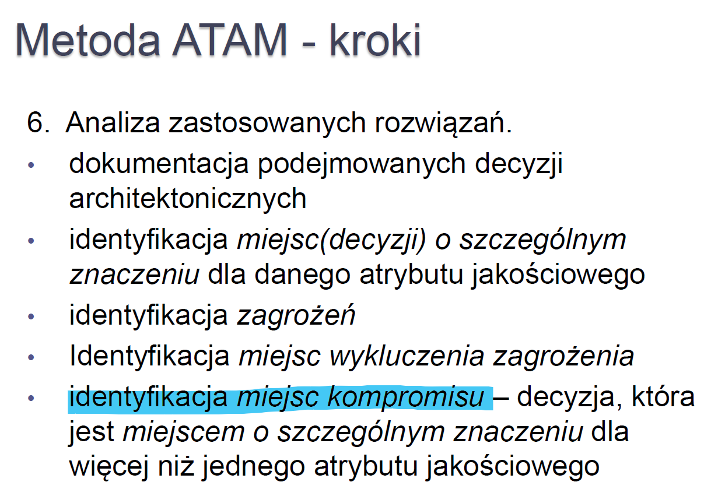

# Co trzeba umieć do projektu

- Założenia systemu 	
  
- Interesariusze (ich cele oraz zadania)
  
- Przypadki użycia (główne oraz alternatywne)
  
- Podstawowy scenariusz
  
- 4+1 Views (logical, development, use case, process, physical)

- Kluczowe wzorce architektoniczne i taktyki 
- MAD 2.0 - decyzje architektoniczne 

# Wykład - istotne rzeczy niebezpośrednio proj

**Architektura** - organizacja (jak coś jest zorganizowane) systemu IT zawarta w komponentach, ich wzajemnych relacjach oraz ich relacjach ze środowiskiem (env). Architektura obejmuje też zasady projektowania i ewolucji systemu IT.

**interesariusz systemu IT** (system stakeholder) - osoba, zespół, organizacja, która ma wpływ lub pozostaje pod wpływem systemu IT. Interesariusze mają określone **zainteresowanie** (concern) związane z systemem.

**widok** - reprezentacja (całego) systemu IT z punktu widzenia pewnego zbioru zainteresowań

**Punkt widzenia** (viewpoint) - specyfikacja konwencji tworzenia i używania widoków. Wzorzec lub szablon określający jak tworzyć pojedyncze widoki. Obejmuje cel i grupę docelową widoku oraz techniki tworzenia i analizy.

## Metody projektowania

### ADD - Attribute-Driven Design

Autor: Rob Wojcik SEI (Carnegie Mellon)

Projektowanie architektury rozpoczyna się po wstępnej analizie wymagań. Należy zidentyfikować czynniki kształtujące architekturę architectural drivers ) kluczowe wymagania funkcjonalne, jakościowe i biznesowe

### RUP 4+1 Views

Robimy albo:

- kaskadowo - zaczynamy od jednego widoku np. scenariusze i potem po kolei reszta i w między czasie uzupełniamy spójność z innymi
- bottom-up - równolegle wszystko

# Interesariusze

**interesariusz systemu IT** (system stakeholder) - osoba, zespół, organizacja, która ma wpływ lub pozostaje pod wpływem systemu IT. Interesariusze mają określone **zainteresowanie** (concern) związane z systemem.

### Przykładowi interesariusze

- klient
- user
- właściciel
- sponsor
- operator
- architekt
- deweloper
- dostawca
- administrator (czym się różni od operatora???)

### Przykłady ich zainteresowań (concers)

- użytkowność
- ergonomia
- koszt wytworzenia/użytkowania
- niezawodność
- cele biznesowe i strategia biznesowa
- zgodność z prawem i regulacjami
- zwinność (co to???)
- złożoność
- wartość biznesowa (znowu???)

# 4+1 Views

**widok** - reprezentacja (całego) systemu IT z punktu widzenia pewnego zbioru zainteresowań

**Punkt widzenia** (viewpoint) - ): specyfikacja konwencji tworzenia i używania widoków. Wzorzec lub szablon określający jak tworzyć pojedyncze widoki. Obejmuje cel i grupę docelową widoku oraz techniki tworzenia i analizy.

**Przkładowe punkty widzenia**

- struktura apki
- funkcje biznesowe
- cele biznesowe
- komponenty i konektory
- decyzje
- infrastruktura
- wydajność
- procesory
- wymagania

### PKW example

PKW - Państwowa Komisja Wyborcza

TKW - Terenowa Komisja Wyborcza

# Wzorce arch. oraz taktyki arch.

**Wzorzec architektoniczny** - konfigurowalny wzorzec struktur systemów IT. Wzorce rozpatruje się w kontekście tzw. widoków. Widok reprezentuje architekturę z punktu widzenia pewnego wybranego aspektu strukturalnego:

- poziomy abstrakcji
- przepływ danych
- przechowywanie danych
- środowisko wykonawcze
- interakcja z userem
- komunikacja między komponentami
- rozmieszczenie komponentów

Opis wzorca to trójka:

- kontekst
- problem (jakiś co często się zdarza)
- rozwiązanie

### Widok poziomów abstrakcji

Wzorce:

- warstwy
- middleware

##### Warstwy

Podział systemu na niezależne fragmenty, rozwijane też niezależnie. Mogą być dostarczane przez różne podmioty. 

---> Zwiększenie przenośności, modyfikowalności i ponownego użycia.

Wady: jak każdego pośrednika - wnosi swój narzut. Budowa warstwowa "od zera" jest bardziej kosztowna.

np. OSI

> kurwa nie podoba mi się ten wykład, on ma ten przedmiot w chuju chyba xd
>
> gdzie omówienie MIDDLEWARE???

### Widok przepływu danych

Wzorce:

- potoki (pipes) i filtry
- sekwencyjne przetwarzanie wsadowe
- procesy biznesowe (vide zajęcia z SOA i procesów) przepływ danych bez narzuconej struktury

##### Potoki i filtry

Each filter exposes a very simple interface: it receives messages on the inbound pipe, processes the message, and publishes the results to the outbound pipe. The pipe connects one filter to the next, sending output messages from one filter to the next. Because all component use the same external interface they can be *composed* into different solutions by connecting the components to different pipes. We can add new filters, omit existing ones or rearrange them into a new sequence -- all without having to change the filters themselves. The connection between filter and pipe is sometimes called *port*. In the basic form, each filter component has one input port and one output port.

https://www.enterpriseintegrationpatterns.com/patterns/messaging/

##### Sekwencyjne przetwarzanie wsadowe

Wsadowe wywołania do usługi zdalnej to dobrze znana strategia zwiększania wydajności i skalowalności. Istnieją stałe koszty przetwarzania dla wszelkich interakcji z usługą zdalną, takich jak serializacja, transfer sieciowy i deserializacja. Pakowanie wielu oddzielnych transakcji w jednej partii minimalizuje te koszty.

### Widok przechowywania danych

Wzorce:

- Współdzielone repozytorium
- Aktywne Repozytorium
- Tablica (ang. blackboard)

##### Współdzielone repozytorium

przykład:

- baza danych
- zbiór plików z kodem w VCS

często realizowane jako klient-serwer

##### Aktywne repozytorium

Repozytorium informuje wszystkich korzystających o pojawieniu się nowych danych lub ich zmianie

##### Blackboard

Odmiana aktywnego repozytorium, gdzie korzystający zapisują się na dane i są o nich informowani. Czyli dają suba na konkretne dane i tylko o nich dostają notify'ie.

### Widok abstrakcji od sprzętu / Widok środowiska wykonawcznego

- Interpreter
- Maszyna Wirtualna
- Systemy regułowe

##### Interpter 

To chyba tak jak Python ma interpreter.

##### Maszyna Wirtualna

To chyba tak jak Java ma JVM.

##### Systemy regułowe

To chyba nie będzie mi nigdy dane sie dowiedzieć :cry:

### Widok interakcji z użytkownikiem

Wzorce:

- Model View Controller
- Prezentacja Abstrakcja Sterownik

##### Model-View-Controller

MVC i wszelkie rozszerzenia. Znany i lubiany.

Problem jaki rozwiązuje:

Jak odseparować UI od logiki biznesowej zachowując możliwość reagowania na działania usera i/lub zmiany danych, na których oprogramowanie działa.

##### Prezentacja-Abstracja-Sterownik

http://kurs.aspnetmvc.pl/Wzorce/PAC

https://en.wikipedia.org/wiki/Presentation%E2%80%93abstraction%E2%80%93control

### Widok komunikacji między komponentami

Wzorce:

- wywołanie bezpośrednie (w programie)
- wywołanie zdalnej procedury (umiejscowionej gdzieś w sieci)
- wywołanie pośrednie (przez zdarzenie)
  - broker
  - publikuj - zarejestruj się (zgłoś się)
  - kolejkowanie wiadomości
  - magistrala
- klient - serwer
- peer-to-peer 

##### Broker

Jak w MQTT

**Broker** -de facto jest odmianą middleware

- nie komunikujemy się bezpośrednio z adresatem komunikatu
- ujednolica sposób wymiany informacji narzucając własny standard interfejsu i formatu przekazywania danych - wystarczy znać format broker nie trzeba znać każdego systemu z osobna

Problem jaki rozwiązuje:

Jak wyeliminować konieczność ich lokalizacji, szczegółów umiejscowienia i dostępu do systemów usługodawców? (Jak SCP w 5G)

Jak zminimalizować liczbę protokołów komunikacyjnych, które musi znać usługobiorca korzystający z usług zewnętrznych? (Jak HTTP w 5G)

##### Magistrala

### Widok rozmieszczenia komponentów

Wzorce:

- arch monolityczna
- arch warstwowa
- arch klient-serwer
- arch amorficzna (peer-to-peer)

# MAD 2.0 - decyzje architektoniczne

Czynniki wpływające na architekturę:

Czyli tzw: **architectura drivers**

### Atrybuty jakościowe

- modyfikowalność/konserwowalność
- wydajność
- niezawodność
- bezpieczeństwo
- ergonomia
- interoperacyjność
- ponowne użycie komponentów
- time-to-market (kontrolowalność xd)

### Taktyki architektoniczne

Kluczowe decyzje konstrukcyjne (architektoniczne) mające wpływ na atrybuty jakościowe.

##### Taktyki dostępności

- Wykrywanie awarii
  - ping/echo
  - protokół bicia serca (keepalive w routerach heartbeat w 5G)
  - głosowanie (nwm co to)
  - Wykrywanie wyjątków (exceptios)
  - self-test
- Przywracanie działania
  - aktywna i pasywne redundancja (czyli architektura 1+1, active/active lub active/standby)
  - check-point  / rollback (jak w bazach danych)
  - resynchornizacja stanu (przywrócenie stanu komponentu z kopii - backup)
  - zapas
- Zapobieganie awariom
  - wyłączenie (ang. removal from service)
  - transakcyjność
  - zapobieganie wyjątkom
  - rozszerzanie zbioru kompetencji (np. dodanie warunków wykrywających wartości prowadzące do niedozwolonych operacji)

##### Taktyki interoperacyjności

- lokalizacja
  - odkrywanie usług (service discovery (jak w 5G))
- zarządzanie interfejsami
  - orkiestracja
  - dostosowywanie interfejsów

##### Taktyki modyfikowalności

- Zwiększenie spójności komponentów
- Ograniczanie powiązań (coupling reduction)
- Zmniejszanie wielkości modułu
- Odkładanie przypisania wartości
- Komunikacja przez pośrednika

##### Taktyki wydajności

- Kontrolowane zapotrzebowania na zasoby
  - Ograniczenie narzutów (np. warstw/komponentów pośredniczących)
  - Ograniczenie liczby obsługiwanych zdarzeń
  - Optymalizacja algorytmów
- Zarządzanie zasobami
  - Zwiększenie ilości zasobów
  - Zrównoleglanie obliczeń
  - Utrzymywanie wielu kopii komponentów i równoważenie obciążenia
  - Arbitraż zasobowy, szeregowanie zadań
  - Pamięć podręczna

##### Taktyki bezpieczeństwa

- Wykrywanie ataków
- Odporność na ataki
  - Identyfikacja użytkowników
  - Autentykacja i autoryzacja użytkowników
  - Szyfrowanie danych
  - Ograniczenie narażenia na ataki (ang. limit exposure)
  - Odseparowanie podsystemów
- Reakcja na ataki
  - Ogranicz lub odbierz dostęp
  - Blokowanie przy próbie włamania
  - Wzbudź alarm - informuj adminów etc.
- Wznowienie po ataku
  - Rejestracja operacji (ang. maintain audit trail)
  - Odzyskiwanie z kopii, użycie komponentu zapasowego

### Wzorzec vs Taktyka vs Strategia arch.

**Wzorzec arch.** - połączenie taktyk arch.

**Strategia arch.** - zbiór taktyk arch.

### Typowe wady arch

- SPOF (Single Point Of Failure)
- Wąskie gardło
- Nadmierna liczba powiązań
  - niska modyfikowalność
- Niespójność (cohesion) modułu
- Rozproszenie funkcjonalności
- Zróżnicowanie (nadmierne) równoważnych komponentów

### Decyzje

Większość systemów IT osiąga swój stan aktualny na drodze ewolucji.
Wiedza architektoniczna to nie tylko aktualny stan architektury ale także ścieżka prowadząca do tego stanu.
Wiedza architektoniczna „ulatnia się” (vaporize) –żeby temu zapobiec powstała koncepcja dokumentowania decyzji architektonicznych.

**Decyzja arch** - opis modyfikacji architektury (w tym usuwania lub dodawania elementów architektonicznych), uzasadnienie, zasady i ograniczenia projektowe oraz dodatkowe wymagania. Decyzja architektoniczna zapewnia (częściową) realizację jednego lub więcej wymagań.

Decyzję opisuje trójka:

- **uzasadnienie** - wyjaśnienie, dlaczego modyfikacja jest wprowadzana
- **zasady i ograniczenia projektowe** - przepisy dla przyszłych decyzji, zasady są obowiązkowymi wskazówkami, ograniczenia pokazują granice, których nie powinny przekraczać przyszłe decyzje
- **dodatkowe wymagania** - decyzja może powodować powstawanie nowych wymagań, które mogą generować potrzeby kolejnych decyzji architektonicznych

### MAD 2.0

Dzieli się na dwie części:

- ADRD (Architecture Decisions Relationship Diagram)
  - On pokazuje relacje między decyzjami. Zaczynamy od jednej decyzje, no to trzeba podjąć kolejną, dochodzimy nimi do następnej i tak mnóstwo jest rozgałęzień
- ADPM (Architecture Decision Problem Map)
  - Tu już rozważamy single decyzje. Jeden element z ADRD. Tutaj podejmujemy próbę podjęcia tej decyzji.

#### ADRD

Elementy tego diagramu to:

- równoległobok
- konektor

**Równoległobok** symbolizuje Decision Problem. Jest na nim jego nazwa. A bg-color odwierciedla status problemu. Status (**defined** - problem świeżo zdefiniowany, being solved istnieje już ADPM dla niego ale jeszcze brak decyzji, **requires reassesment** - żeby rozwiżać ten problem, to trzeba podjąć na nowo decyzje w już rozwiązanym problemie, **resolved** - wiadomka)

**Konektor** - shows that one problem led to another, może mieć dwa typy zwykły oraz, że jeden problem ogranicza możliwości decyzyjne w innym

#### ADPM

Elementy mapy myśli to:

- równoległobok

- zaokrąglony prostokąt
- sześciokąt
- kwadrat
- elipsa
- okrąg

**Równoległobok** symbolizuje znowu Decision Problem, to jest reference do ADRD. 

**Elipsa** - to "decision maker", interesariusz który jest odpowiedzialny za tę decyzje, połączona z problemem

**Okrąg** to wymaganie, połączony z problemem

**Zaokrąglony prostokąt** - to "solution", wskazuje jedno z rozwiązań problemu , połączony z problemem

**Sześciokąt** - połączony  z solution, wskazuje jego wadę

**Kwadrat** - połączony z solution, wskazuje jego zaletę

Defined - świeżo zdefiniowane, jeszcze nie oceniliśmy tego

Infeasible - nie nadaje się 

Feasbie - rozważamy to

Chosen - decyzja podjęta, 

#### Przykład

The company wants to offer a new product composed of the installation and
maintenance of fibre optic networks services and the delivery of IT equipment being
sold together as a product bundle. The product can be sold by two subsidiaries of the
telecom company under their own brand. There are various financing options planned
for such a product: wire transfer, credit instalment payments or even leasing.
The product components will be provided by two independent external
subcontractors: “subcontractor A” will deliver IT equipment, “subcontractor B” will
install fibre-optic networks in the clients’ premises and will configure the delivered
equipment so that both elements operate together.

# Kolos opracowanie pytań z Memorizer

**widok** - reprezentacja (całego) systemu IT z punktu widzenia pewnego zbioru zainteresowań

**Punkt widzenia** (viewpoint) - specyfikacja konwencji tworzenia i używania widoków. Wzorzec lub szablon określający jak tworzyć pojedyncze widoki. Obejmuje cel i grupę docelową widoku oraz techniki tworzenia i analizy

4+1 Views:

- logical, 
- development, 
- use case, 
- process, 
- physical

Czyli na diagramie ADRD.

Decyzja może być swieżo zdefiniowana i jeszcze nic z nią nie robiono. 

Może się okazać, że wymaga przedecyzjonowania jakichś podjętych wcześniej.

Może być w trakcie podejmowania.

Może być zakończona. 

ATAM : określa stopień w jakim a rchitektura osiąga określone atrybuty jakościowe i pozwala lepiej zrozumieć jakie są zależności między tymi atrybutami czyli to, jakie **kompromisy (tradeoffs)** pomiędzy nimi będą potrzebne.

**Taktyki architektoniczne** - kluczowe decyzje konstrukcyjne (architektoniczne) mające wpływ na atrybuty jakościowe.

