# SOA

## Web Service

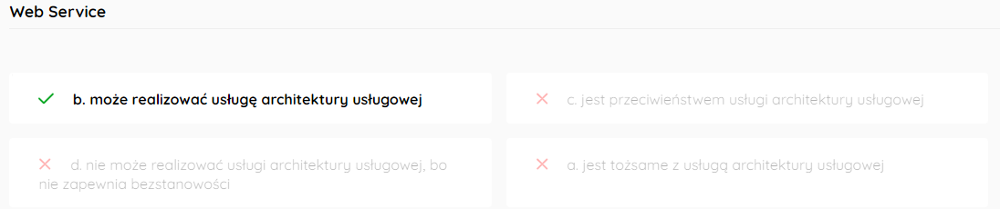

Ratkowski nie wiem co tu rozumie jako web service. 

Architektura Usługowa - Service Oriented Architecture

**Usługa** - wejście -> zachowanie -> wyjście
Cechy usługi:

- autonomia
- komponowalność
- reużywalność
- bezstanowość - użycie usługi nie modyfikuje stanu tej usługi
- abstrakcja od implementacji
- “luźne powiązanie” (loosely coupling)
- “odkrywalność” (discoverability) - możliwość odszukania pożądanej usługi
- interoperacyjność - niezależność od platformy

**Web Service** - To inaczej usługa internetowa, która pozwala na komunikowanie się klientowi z serwerem za pomocą sieci. Standardy to REST albo SOAP. Oba te standardy wpisują się w standard usługi zdefiniowanej poprzez SOA. Tak, więc Web Service też.

## SOA nieprawdziwe

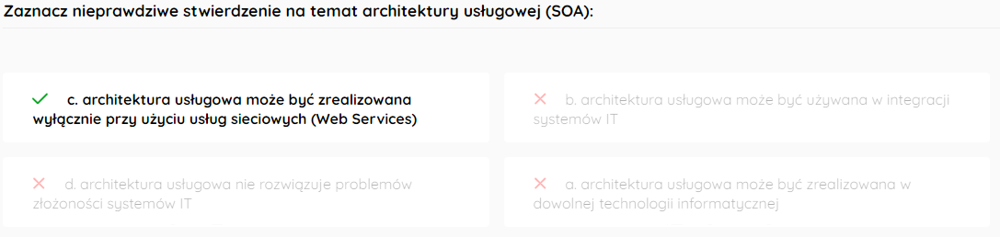

No to takie na logikę xd

## Orkiestracja to

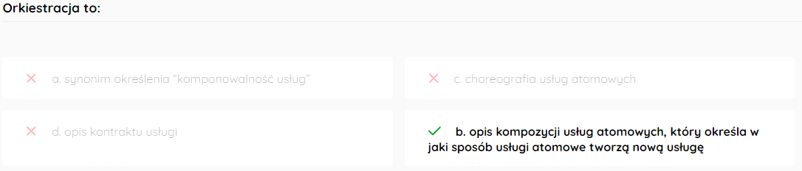

**Orkiestracja** - opis, w jaki sposób usługi składowe działają, żeby stworzyć nową usługę

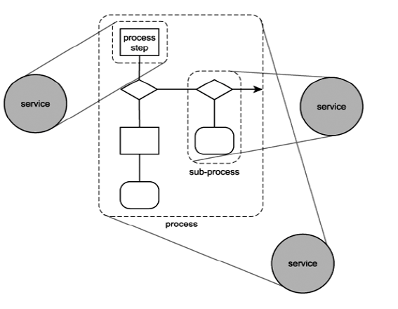

## Usługa bezstanowa

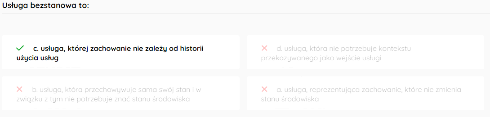

## Cechy SOA

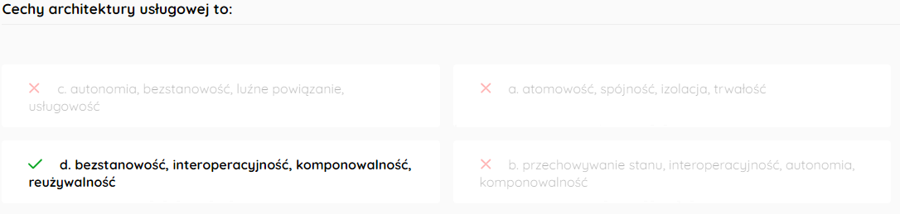

**Usługa** - wejście -> zachowanie -> wyjście
Cechy usługi:

- autonomia
- komponowalność
- reużywalność
- bezstanowość - użycie usługi nie modyfikuje stanu tej usługi
- abstrakcja od implementacji
- “luźne powiązanie” (loosely coupling)
- “odkrywalność” (discoverability) - możliwość odszukania pożądanej usługi
- interoperacyjność - niezależność od platformy

## BPEL

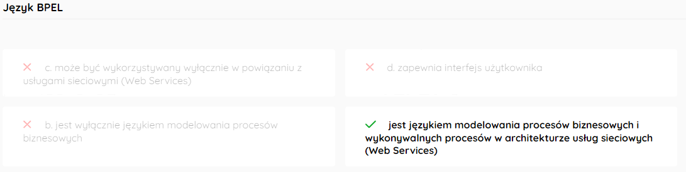

**Business Process Execution Language for Web Services** (BPEL or BPEL4WS) is a language used for the definition and execution of business processes using Web services.

# Architektura Korporacyjna

## TOGAF to

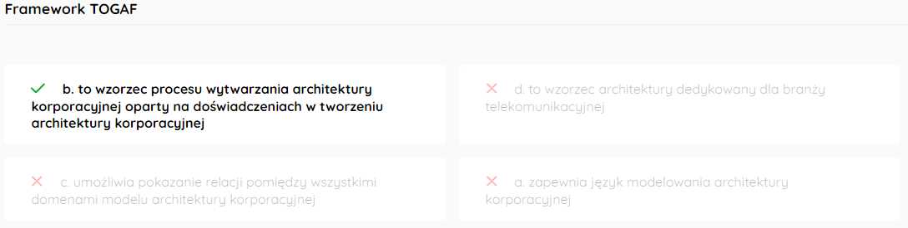

To najwyższego poziomu wzorzec na to jak w ogóle podejść do tematu Enterprise Architecture. 

## Togaf ADM a Archimate

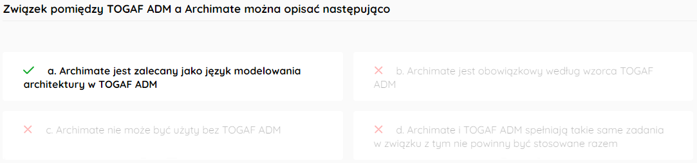

TOGAF ADM to metodologia na tworzenie Architektury Korporacyjnej. Zawiera opis jak zrobić desing, planowanie, implementacje i zarządzanie architekturą korporacyjną. 

Archimate to diagramowy język modelowania, który służy do reprezentowania Architektury Korporacyjnej.

TOGAF ADM jako jeden z elementów ma język modelowania i może nim być, a wręcz zalecany jest Archimate. 

## Archimate: elementy behavioralne

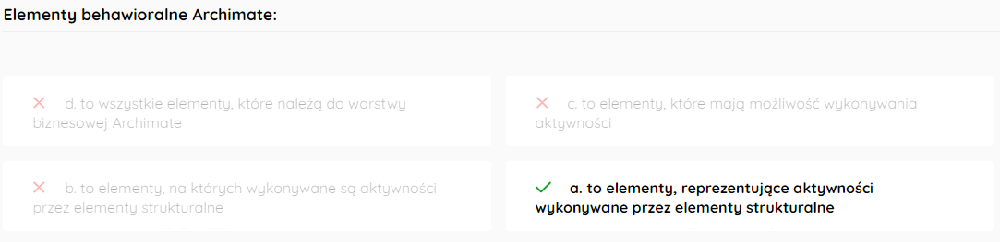

Są 3:

- Stukturalne - określają rzeczy, które mogą robić aktywności
- Behavioralne - określają aktywności
- Informacyjne - reprezentują dane

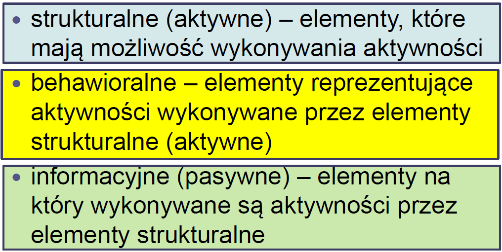

## Core concepts Archimate są podzielone na warstwy

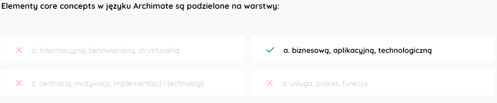

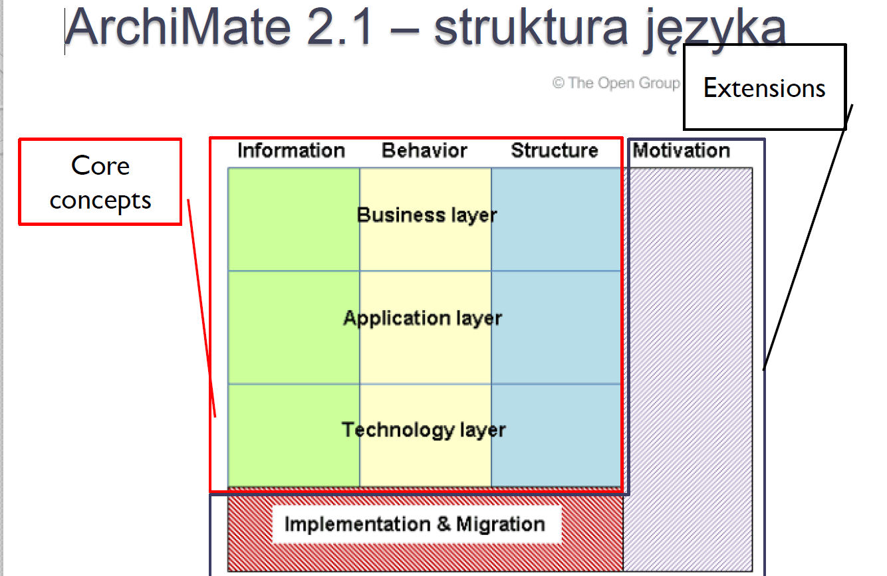

## faza Architecture Vision w TOGAF ADM

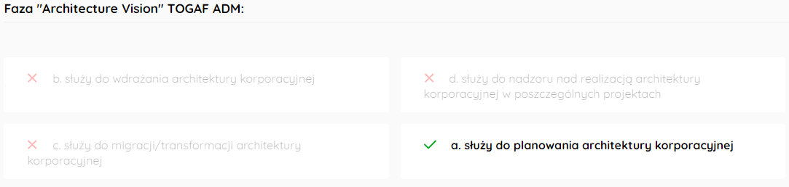

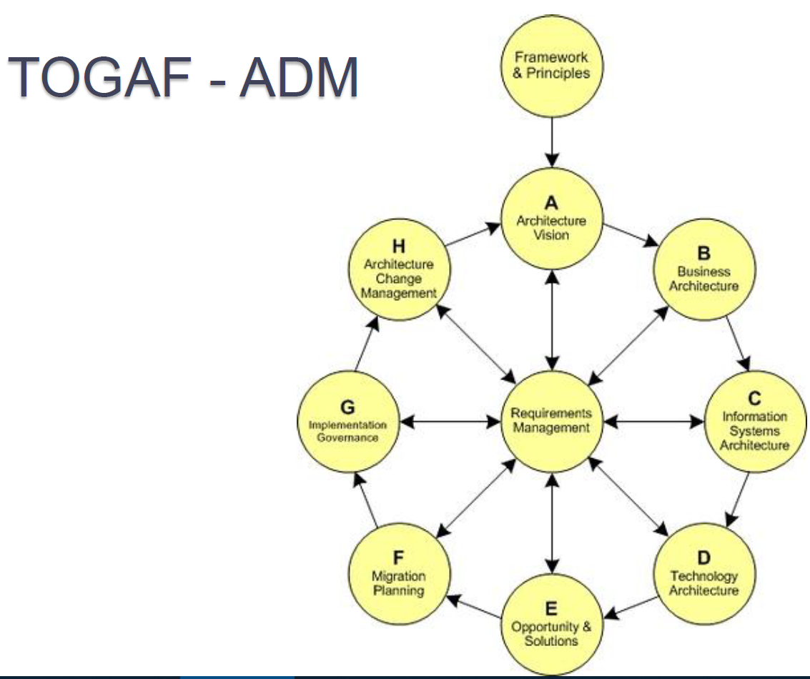

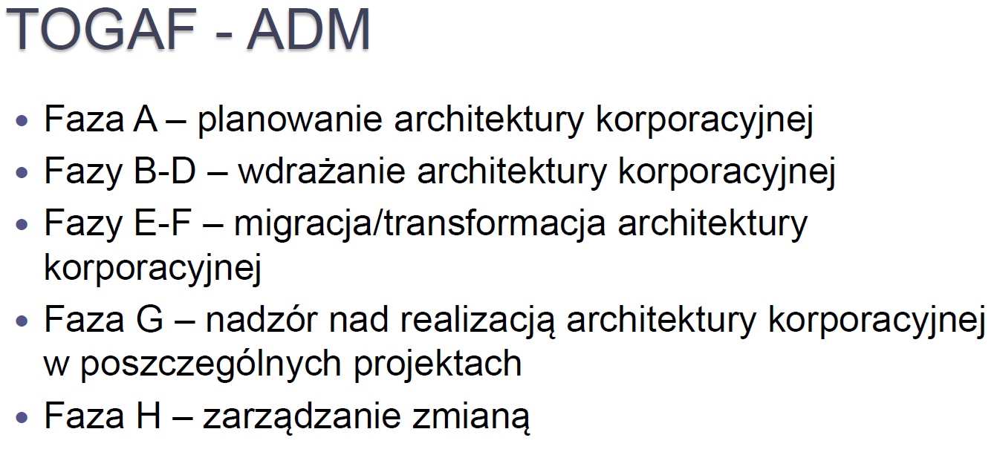

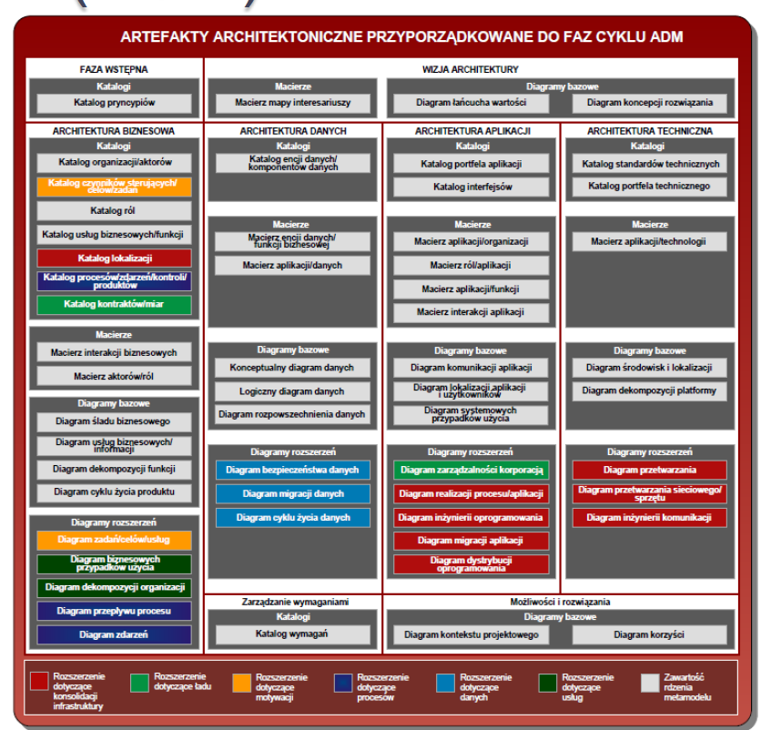

## Algebraiczna definicja EA

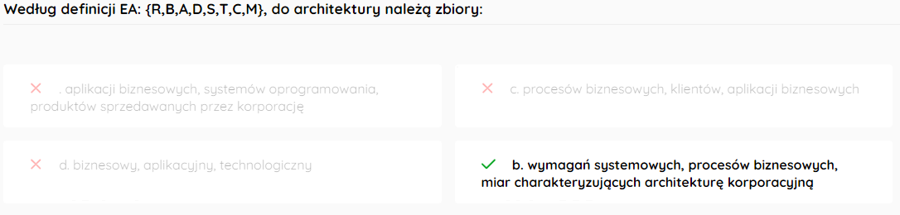

**EA: {R, B, A, D, S, T, C, M}**

- R(**Requirements**) zbiór wymagań systemowych
- B (**Business Processes**) zbiór procesów biznesowych
- A (**Applications**) zbiór aplikacji biznesowych
- D (**Data**) zbiór danych
- S (**Systems**) zbiór systemów oprogramowania
- T (**Technical components**) zbiór komponentów technicznych
- C (**Constraints**) zbiór ograniczeń dotyczących poszczególnych elementów zbioru EA
- M (**Metrics**) zbiór miar, które charakteryzują architekturę korporacyjną

## EA żeni biznes z systemami IT do jego usprawniania

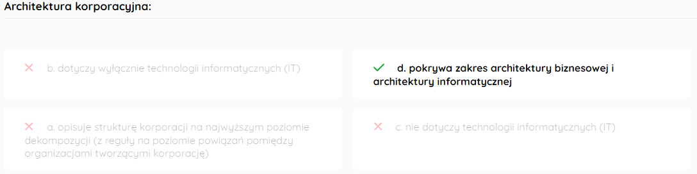

## Fałszywe zdanie

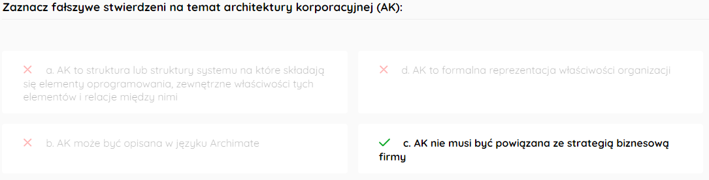

# DDD

## Domeny

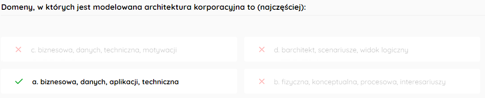

Modelowanie odbywa się w 4 zasadniczych domenach:

- Biznesowa
  - Modelujemy procesy biznesowe, procesy które przynoszą kasę
- Danych
  - Modelujemy dane, relacje między nimi, oceniamy potrzebność ich trzymania, robimy Big Data
- Aplikacji
  - Modelujemy apki w naszych systemach
- Techniczna
  - Modelujemy infra naszych sieci

