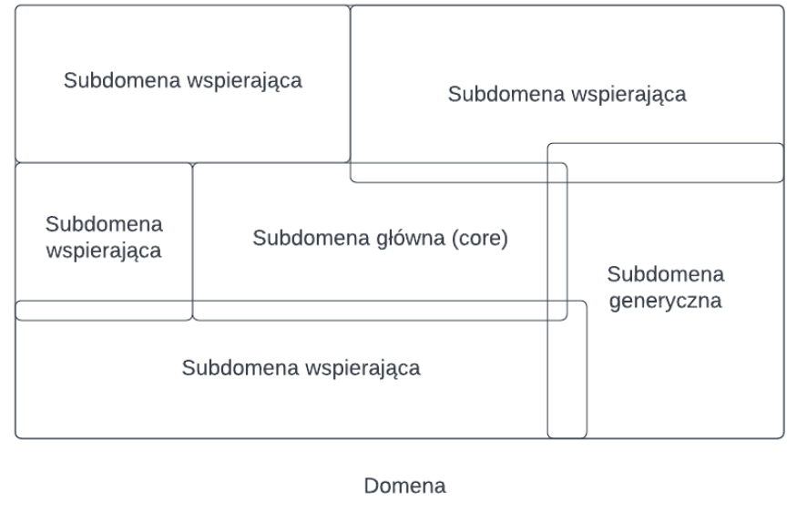

# Domain Driven Design

Celem DDD jest analiza przedwykonawcza i projekt architektury złożonych systemów IT danej korporacji.

Fundamentem DDD jest oparcie tego procesu na dobrze przemyślanym modelu, który odzwierciedla a nawet definiuje organizację, która korzysta z tego systemu. 

## Strategiczne a Taktyczne DDD

**Strategiczne DDD** - podstawowe modele i pojęcia DDD, jest podzielona na:

- Przestrzeń problemu - domeny i subdomeny (problemu - czyli organizacji)
- Przestrzeń rozwiązania - bounded context i ubiquitous language

Korzysta to z zasady, żeby nie mieszać definicji problemu (problem space) z jego rozwiązaniem (solution space).

## Przestrzeń problemu

Czyli domena i subdomeny

**Domena** - obszar zainteresowań i odpowiedzialności organizacji. Zamknięty obszar wiedzy na określony temat.

**Subdomena** - część domeny.

**Domena jako pojęcie najwyższego poziomu w hierarchii DDD** - to jest cała organizacja i jej procesy biznesowe.

### Core domain

Subdomena główna jest tym co wyróżnia organizację i czyni szczególną na tle innych. Organizacja nie może odnieść sukcesu, albo nawet istnieć bez bycia wyjątkowo sprawna w subdomenie głównej.
Ponieważ subdomena. główna jest tak ważna powinna być traktowana z najwyższym priorytetem i najwyższą uwagą. Organizacja powinna rozwijać subdomenę. główną "od zera". Czyli pośrednio wnioskując nie należy jej rozwoju powierzać zewnętrznym podmiotom (outsource).

### subdomena wspierająca

Subdomena wspierająca jest także istotna dla sukcesu organizacji, jednakże nie należy do kategorii głównej. Rozwiązania w domenie wspierającej wymagają pewnego poziomu dostosowania do potrzeb organizacji.

### subdomena generyczna

Subdomena generyczna nie zawiera niczego specjalnego dla organizacji, chociaż wciąż jest potrzebna dla funkcjonowania. W zakresie domeny generycznej sugerowane jest zastosowanie gotowego rozwiązania i nie dostosowywania jego do specyfiki organizacji.

### Definiowanie domen

Musi wynikać z cech organizacji. To znaczy, że w ramach modelowania nie narzuczamy domen, ale <u>staramy się je odkryć</u>. W praktyce właściwy podział na domeny nie jest trywialny. Wymaga z jednej strony wiedzy na temat kontekstu organizacji, a z drugiej spojrzenia out of the box. Często jest to najtrudniejsza część modelowania DDD.

Ponadto domeny mogą ewoluować. Zarówno wraz ze wzrostem zrozumienia modelu przez interesariuszy oraz z powodu naturalnych zmian w organizacji.

### Odkrywanie domen

Praktycy wdrażający DDD często posługują się metodą Big Picture Event Storming, zaproponowaną przez Alberto Brandliniego.
BPES jest formą frameworku organizacyjnego z elementami bardzo prostego modelu,który w ramach krótkiego warsztatu typu "burza mózgów" daje możliwość zidentyfikowania modelu subdomen.
Tradycyjnie odbywa się przy użyciu różnokolorowych karteczek przyklejanych przez uczestników warsztatów na tablicy (oczywiście może być też w formie on-line zużyciem np. miro-board).

## Przestrzeń rozwiązań

### Bounded context

**Bounded context** to podsystem z modelem, który ma jasne granice (bounded). Modelbounded contextu jest opisany jednoznacznym językiem **ubiquitous language**. Bounded context zawiera się w subdomenie.
Jedna subdomena może zawierać wiele bounded contextów.

#### Różnica z subdomeną:

**Subdomena** należy do przestrzeni problemu. Subdomena istnieje ponieważ tak jest poukładana organizacja i tak wygląda model biznesowy.
**Bounded context** to przestrzeń rozwiązania; bounded context istnieje bo tak go zdefiniowaliśmy. To jest nasza decyzja rozwiązania problemu.
Relacja między subdomeną, a bounded context jest taka, że bounded context musi się mieścić w ramach jednej subdomeny.

#### Przykład

Strzałki oznaczają relację między kontekstami, źródło strzałki zalezność od celu strzałki. Medical Exams zależą od Personal Information, potrzebują ich. Strony relacji nazywane są **upstream** (Medical Exams -> Personal Information) i **downstream** (Personal Information -> Medical Exams). Ten co korzysta (cel) pobiera (download jak w downstream) informacje od źródła. 

Ubiquitous language

Dosłownie "język wszechobecny". Język jednoznaczny i powszechnie stosowany wramach jednego bounded contextu. Pod pojęciem języka mamy tu na myśli pojęcia,ich znaczenie i relacje pomiędzy nimi.
Wszechobecność oznacza, że jest używany wszędzie: w dokumentacji, w specyfikacji,w kodzie, a także w rozmowach specjalistów.
To samo pojęcie w różnych bounded context-ach może znaczyć coś zupełnie innego.

> Trochę jak w Envelo miałem "słownik pojęć". Ustalenie jednolitego słownictwa, żeby szybciej gadać i każdy poprzez to samo słowo miał to samo na myśli, a jak wiadomo głodnemu chleb na myśli :smiling_imp:, i to jest właśnie dobry przykład, bo każdy z nas pomyślał o tym samym ;)

## Taktyczne DDD

Elementy strukturalne odzwierciedlające/modelujące subdomenę:

- value object - obiekt danych, które jest immutable
- encja - obiekt danych. który jest mutable, zmiany atrybutów tych obiektów powinny być kontrolowane przez reguły biznesowe

Elementy modelujące zachowania:

- zdarzenia - modeluje coś co zdarza się w systemie i może być interesujące dla innych części modelu, wykorzystuje się tu kolejki, brokery, logi zdarzeń model publish subscribe
- polityki
- agregaty - grupa encji, która ma wspólny cykl życia i wspólne reguły biznesowe
- reguły biznesowe

Elementy porządkujące:

- serwisy domenowe - element, który reprezentuje logikę biznesową (regułybiznesowe), która wykraczają poza pojedynczą encję. Musi być bezstanowy, wyspecjalizowany do jednego zadania, zawierać logikę biznesową, która nie pasuje nigdzie indziej, może wchodzić w interakcję z innymi serwisami, może generować zdarzenia
- repozytoria - zbiór encji lub agregatów z operacjami umożliwiającymimanipulacje na tym zbiorze - CRUD
- fabryki - odpowiedzialne za tworzenie agregatów

# SOA

**Service Oriented Architecture** - koncepcja tworzenia systemów informatycznych w oparciu o usługi.

## Usługa

**usługa** - każdy element oprogramowania, mogący działać niezależnie od innych oraz posiadający wyspecyfikowany interfejs, za pomocą którego udostępnia realizowane funkcje. Sposób działania każdej usługi jest w całości zdefiniowany przez interfejs ukrywający szczegóły implementacyjne

wejście - zachowanie - wyjście

Cechy:

- autonomia - może istnieć zupełnie sama
- komponowalność - z usług można komponować usługi
- reużywalność - można jednej usługi używać w wielu systemach IT
- bezstanowość - użycie usługi nie modyfikuje jej w żaden sposób, nie przetrzymuje ona żadnego stanu, nie ma zbioru swoich zmiennych
- abstrakcja od implementacji - interfejs definiuje usługę, można ją zaimplementować na wiele sposobów
- luźne powiązanie - loosely coupling
- odkrywalność (discoverability) - możliwość odszukania pożądanej usług (5G::NRF)
- interoperacyjność - niezaleźność od platformy, inne systemy też mogą z niej korzystać

### stanowość vs bezstanowość

Usługa stanowa (nie chcemy takiej)

1. OtwórzKoszyk(klient X)
2. DodajDoKoszyka (towar Y)
3. DodajDoKoszyka (towar Z)
4. ZamknijKoszyk (klient X)

Usługa bezstanowa

1. PobierzKoszyk(klient X) -- rezultatem wywołania jest `koszyk X`
2. DodajDoKoszyka (towar Y, koszyk X)
3. DodajDoKoszyka (towar Z, koszyk X)

### Komponowalność

**orkiestracja** (orchestration) - opis, w jaki sposób usługi składowe działają, żeby stworzyć nową usługę

**choreografia** - opis w jaki sposób usługi się komunikują, w celu osiągnięcia określonego efektu

### Odkrywalność

## Architektura usługowa

Na samej górze SOA czyli cała architektura Do niej należy:

- Interfejs usera, czyli wejście do systemu, opis jak ma się komunikować z usługami
- Usługa sama w sobie, zaraz rozbijemy ją na elementy, które zawiera każda pojedyncza
- Katalog usług - cztli 5G::NRF
- Szyna usług - czyli połączenie między nimi i do nich

Każda pojedyncza usługa ma:

- Swój interfejs - wiadomix
- Implementacje - co rozbija się dalej na:
- Kontrakt - termin "kontrakt" odnosi się do formalnej specyfikacji, która definiuje, jak usługi powinny być używane. Kontrakt w SOA określa zasady interakcji pomiędzy usługą a jej konsumentami. WSDL - Web Service Description Language np. to robi

Każda implementacja usługi ma:

- logika biznesowa
- dane

### Model wartwowy usług

