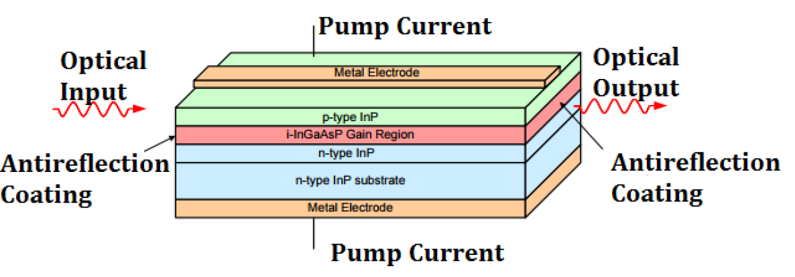
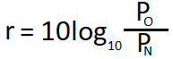
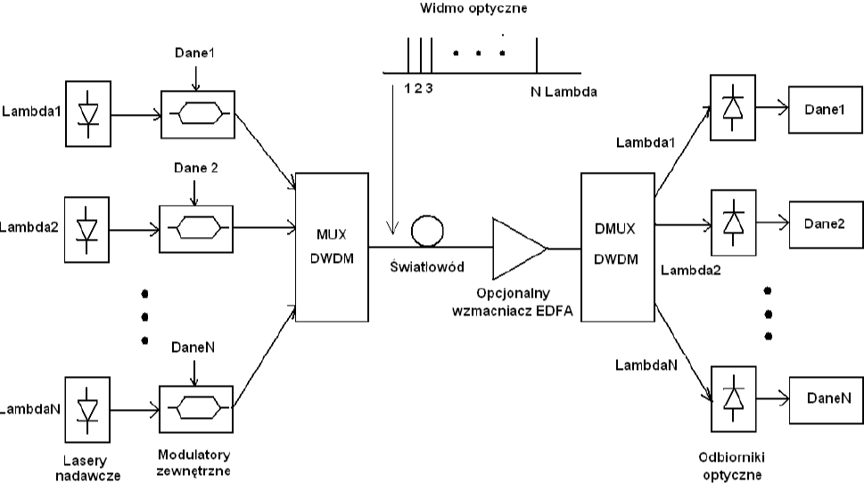
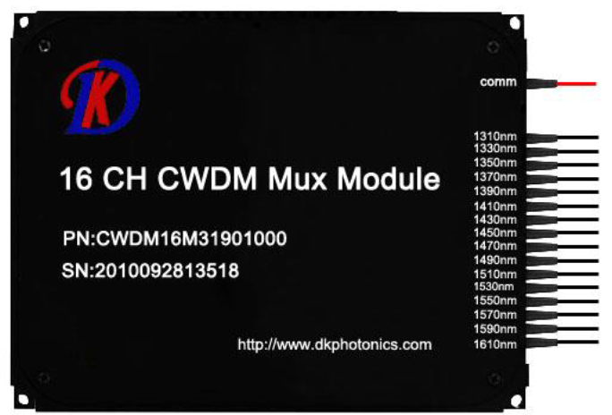
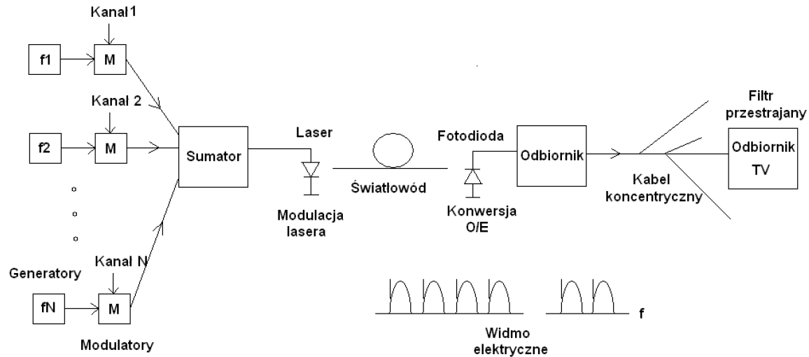
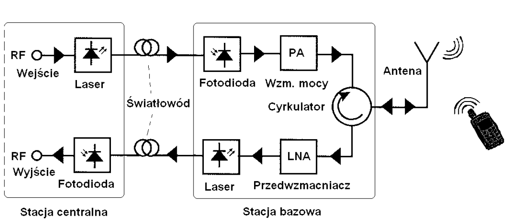
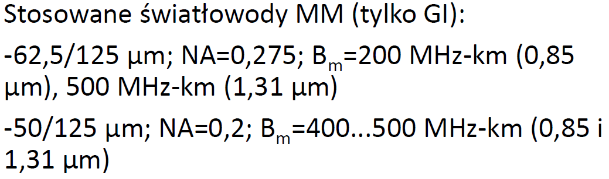
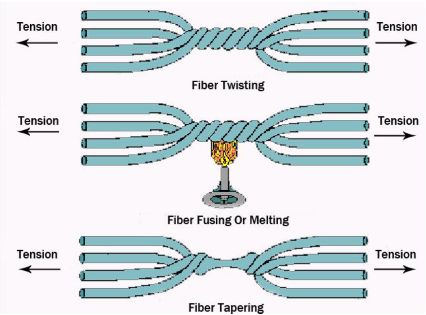

> Konwencja
>
> Jak coś ma * na końcu to znaczy, że "wyjaśnić"

# Pytania z kolosa

- Parametr OPP :white_check_mark:
- Dyspersja Polaryzacyjna :white_check_mark:
- Dyspersja międzymodowa. W jakich światłowodach występuje
- Maska wykresu oka :white_check_mark:
- System RoF (rysunek + opis działania) :white_check_mark:
- System ze zwielokrotnieniem SCM (rysunek + opis działania) :white_check_mark:
- System ze zwielokrotnieniem WDM (rysunek + opis działania) :white_check_mark:
- Wzmacniacz EDFA (rysunek + opis działania) :white_check_mark:
- Jakie rodzaje zwielokrotnienia wykorzystywane są w systemach 40G i 100G Ethernet?
- Od jakich parametrów wzmacniacza optycznego i w jaki sposób zależy poziom szumów na jego wyjściu? :white_check_mark:
- Sieć PON: cechy w warstwie fizycznej :white_check_mark:
- Sieć PON: jak najprościej przeprowadzić atak DoS posiadając dostęp do ONU

> TDMA wykorzysywane jest w sieciach radiowych oraz w PON

# Rozdziały ze slajdów

2 Przypomnienie podstaw

30 Wzmacniacze optyczne :white_check_mark:

56 Parametry systemów optycznych :white_check_mark:

86 Systemy WDM :white_check_mark:

113 Sieci OTN :white_check_mark:

131 Systemy SCM :white_check_mark:

146 Systemy RoF :white_check_mark:

155 Sieci LAN :white_check_mark:

171 Optyczne sieci dostępowe (PON)

203 NGPON2

210 Transmisja Koherentna

240 Kryptografia Kwantowa

254 Ataki w sieciach optycznych

# Wzmacniacze optyczne

**Wzmacniacz optyczny** - element wzmacniający bezpośrednio sygnał optyczny bez używania konwersji optoelektrycznej i elektrooptycznej (czyli nie zamienia go na prąd, a potem z powrotem na światło). 

Wzmacniacz warto zestawić z regeneratorem, urządzeniem które sygnał optyczny na wejściu zamienia na elektryczny, "regeneruje" czyli przywraca początkowy kształt i resynchornizuje (jeszcze raz synchronizuje), a następnie zamienia na sygnał optyczny i nadaje na wyjście. Wzmacniacz jedyne co robi to zwiększa moc sygnału. Jest dużo prostszy niż regeneratory stąd wynika jego kilka zalet.

**Zalety**

- prostsza konstukcja, więc tańszy oraz mniej awaryjny
- mniejszy pobór mocy niż regenerator
- skoro zwiększa tylko moc to jest niezależny od protokołu i szybkości transmisji (inaczej niż regenerator, który musi wiedzieć jak naprawić sygnał)
- można go stawiać co 120km, a nie jak regenerator co 60, więc - możliwe większe odstępy niż w przypadku regeneratorów
- skoro jest niezależny od protokołu i szybkości transmisji, to dużo łatwiej linii z takim torem zrobić upgrade

**Wady**

- Brak regeneracji sygnału (czyli przywrócenia początkowego kształtu i resynchronizacji)
- Wszystkie niekorzystne zjawiska w torze narastają (dyspersja, zjawiska nieliniowe, szumy)
- Dodaje własne szumy do sygnału (**ASE - Amplified  Spontaneous Emission**)

**Typy**

- **SOA - Semiconductor Optical Amplifier** - wzmacniacze półprzewodnikowe
- **Wzmacniacze Ramana**
- **EDFA (Erbium Doped Fiber Amplifier)** - wzmacniacze domieszkowane Erbem

## Wzmacniacze SOA

Wykorzystują struktury półprzewodnikowe podobne do do struktur laserów półprzewodnikowych, w których obszarze aktwnym dokonywane jest wzmocnienie sygnału na podobnej zasadzie, jak w laserach czyli wskutek tzw. **emisji wymuszonej**. Jednak w odróżnieniu od laserów SOA pozbawiony jest sprzeżenia zwrotnego, a mało tego stosuje się środki by tego uniknąć.

Szarookość pasma* to kilkadziesiąt nanometrów np. 40nm.

> Czyli ile może wejść na wejście wzmacniacza

Uzyskiwane wzmocnienie to G=20dB (czyli niezbyt dużo)

Mają one stosunkowo duże wartości współczynnika szumów NF = 6..9dB

W zakresie liniowym są stosowane w 2gim oknie transmisyjnym. 

W zakresie nieliniowym (po nasyceniu) bardzo szybko reaguje na zmiany poziomu mocy i wykorzystuje się je w 3cim oknie transmisyjnym.

Powłoka anty-odbiciowa jest po to, żeby nie było sprzężenia zwrotnego.

Potecjalnie niski koszt

małe wymiary

używany przede wszystkim na 1310nm

## Wzmacniacze Ramana

Tu mechanizmem jest wymuszone **rozpraszanie Ramana w światłowodzie** **(SRS - Stimalated Raman Spectroscopy)**, które powoduje przenoszenie energii z pompy optycznej do sygnału użytecznego: foton pochodzący z pompy traci energię tworząc foton o mniejszej energii (odpowiadającej sygnałowi użytecznemu), pozostała zaś część energii zostaje pochłonięta przez ośrodek w postaci wibracji molekularnych. Więc fala krótsza oddaje moc/energię fali dłuższej. 

Światło pompujące może rozchodzić się w tym samym kierunku co sygnał, odwrotnym lub w obu kierunkach.

Długość fali pompy musi być niższa aniżeli długość fali sygnału, przy czym najlepiej jeśli ta różnica wynosi około 100nm. Więc np. dla wzmocenia sygnału o λ=1500nm, należy użyć pompy o λ=1.45µm. 

Zasadniczą cechą tych wzmacniaczy jest to, że do osiągnięcia istotnej wzmocnienia wymagają one dużych długości (kilometry a nawet dzisiątki kilometrów).

Największą zaletą jest to, że do osiągnięcia wzmocnienia sygnału wystarczy dysponować laserem pompującym fale o odpowiednio niższje długości, największa zaś wada to to, że ten laser musi mieć bardzo dużo moc.

Są dwa rodzaje tych wzmaków:

- skupiony/dyskretny - użyto tu nawiniętego na szpuli i zamkniętego w obudowie światłowód, w którym tak dobrano profil współczynnika załamania, aby zwiększyć zjawisko SRS
- rozłożony - składa się jedynie z pompy optycznej o bardzo dużej mocy i sprzęgacza, a role ośrodka wzmacniającego pełni sam światłowód, przy czym długość na której dochodzi do wzmocnienia sięga dziesiątek kilometrów.

Typowe długości fal na których pracuję te wzmaki to 1450nm lub 1480nm.

Inna zaleta to to, że używając kilku laserów pompujących o różnych długościach fal można osiągnąć bardzo szerokie pasma wzmacniacza przekraczające nawet 100nm, co jest zupełnie niedostępne innymi metodami.

Wadą jest małe wzmocnienie, które nie przekracza G = 10db

Poziom szumów z kolej nie może być mniejszy niż NF > 3dB (jest to poziom zbliżony do EDFA).

## Wzmacniacze EDFA

Konstrukcja:

Wzmacniany sygnał z zakresu 1530...1560nm wraz z sygnałem pompującym  wprowadzane są przez sprzęgacz WDM do światłowodu domieszkowanego erbem. 

Sygnał pompujący może mieć jedną z dwóch długości fal:

- 980nm - pozwala osiągnąć mniejsze szumy
- 1480 nm - umożliwia osiągnięcie większego wzmocnienia

Moce sygnału pompującego to od kilkadziesiąt do kilkaset mW.

Wzmocnienie sygnału zachodzi w światłowodzie erbowym i wykorzystuje emisje wymuszoną w trójpoziomowym układzie jonów erbu

Wskutek pompowania jony erbu wskakują na poziom nietrwały o krótkim czasie życia (rzędu 1µs) a z nich na poziomy metastabilne o stosunkowo długim czasie życia (rzędu 10ms). Jeśli te poziom są gęściej obsadzone aniżeli poziomy w paśmie podstawowym, to dochodzi do tzw. **inwersji obsadzeń**, przy której możliwa jest emisja wymuszona. 

Czyli po prostu foton o odpowiedniej energii (równej różnicy między energiami poziomów metastablinych i podstawowych) wymusza przejście jonu erbowego z poziomu metastabilnego na podstawowy, czemu TOWARZYSZY GENERACJA DRUGIEGO FOTONU O IDENTYCZNYCH WŁAŚCIWOŚCIACH CO FOTON WYMUSZAJĄCY (ta sama długości fali, polaryzacja, fasza, kierunek rozchodzenia się). No i oczywiście foton powstały w wyniku emisji wymuszonej może stać się fotonem wymuszającym dla kolejnych jonów i tak to się kręci.

Inwersja obsadzeń zachodzi przy dużych gęstościach mocy sygnału pompującego dlatego, aby zwiększyć to zjawisko to nie tylko używa się laserów pompujących o dużej mocy, ale też ten światłowód erbowy ma średnica rdzenia bardzo mniejszą niż taki zwykły telekomunikacyjny. 

Potem tylko jeszcze EDFA zawiera

- filtr sygnału pompującego, który po prostu usuwa sygnał o długości fali pompy
- izolator optyczny, który zapobiega wzmacnianiu sygnałów odbitych i powracających  w stronę nadajnika
- rozdzielacz niesymetryczny, który odprowadza niewielką część wzmocnionego już sygnału do fotodiody monitorującej, co pozwala na monitorowanie i odpowiednie sterowanie pracą wzmaka.

Efektywne pasmo pracy wzmaka EDFA to 1530nm-1560nm Przy czym charakterystyka wzmocnienia nie jest równa jak widać na rysnku:

Uzyskiwane wzmocnienia to aż do G=40dB, pasmo to 35nm (no bo od 1530nm do 1565nm), a szumy NF = od 4 do 7 dB.

## Szumy we wzmacniaczach

Każdy ze wzmaków opiera się na emisji wymuszonej, a niestety obok niej występuje też zawsze **emisja spontaniczna**, która o zgrozo też jest wzmacniana poprzez emisję wymuszoną, a strumień jej fotonów ma charakter losowy tworząc szum optyczny.

Ten szum nazywamy **ASE - Amplified Spontaneous Emission**.

Moc tego szumu zależy od:

- F - współczynnik szumów
- G - wzmocnienie
- h - stała Plancka
- f - częstotliwość fotonu (więc hf to jego enerfia)
- Δf - pasmo

Współczynnik szumów to się wyraża wzorem OSNRwe/OSNRwy - gdzie OSNR to optyczny stosunek sygnału do szumu na wejściu/wyjściu wzmacniacza.

Żeby mieć BER=10-12, to wymagany OSNR > 14. Ale w praktyce i tak on wynosi >20dB

Linia transmisyjna składająca się z N idetycznych sekcji, gdzie każda składa się z odcinka światłowodu o całkowitym tłumieniu L [dB], zakończonego wzmakiem o wzmocnieniu G=L i współczynniku szumów F wartość OSNR na wyjściu takiego czegoś wynosi:

Gdzie Ps to moc sygnału na wejściu systemu.

# Parametry systemów optycznych

W książce rozdział 3.2.1, 3.2.2, 3.2.3

Interfejs nadawczy - **S** (MPI-S)

Tor optyczny - **S-R**

Interfejs odbiorczy **R** (MPI-R)

## Parametry na styku S

### Typ źródła światła

Wykorzystywane są:

- diody elektroluminescencyjne (LED)
- lasery półprzewodnikowe

LED z racji ograniczonego **pasma modulacji***  i dużej szerokości **linii widmowej*** jest ograniczone jedynie do:

- linii wewnętrznych (SDH kod aplikacji I)
- drugiego okna transmisyjnego
- najmniejszych przepływności (SDH::STM 1,  SDH::STM 4)

Czyli LED ma małe przepływności i zasięgi.

W reszcie przypadków (w SDH stosuje się lasery).

### Zakres długości fal nadajnika

Źródło musi dawać taki zakres długości fal, których tłumienie światłowodu jest małe (w jednym z okien transmisyjnych).

Jest podawane jako średnia długości fali

- co przy źródłach o bardziej złożonym widmie (LED, laser wielomodowy), wymaga obliczenia średniej z rozkładu gęstości  widmowej mocy optycznej 
- 

### Szerokość linii widmowej nadajnika, Szerokość widma źródła światła

Określenie maksymalnych wartości szerokości widma źródła, jest niezbędne gdyż w połączeniu z dyspersją chromatyczną określają one **rozszerzenie impulsu*** przy propagacji.

Dla LED oraz laserów wielomodowych definiowane to jest jako odchylenie standardowe rozkładu widmowego od wartości średniej

Przy czym dla laserów wielomodowych bierzemy tylko te mody, których moc nie jest mniejsza niż 1/100 (-20dB) modu najmocniejszego

Dla laserów jednomodowych definiujemy jako całkowita szerokość linii widmowej na poziomie spadku o 20dB od poziomu maksymalnego,

Wartości dla:

| Źródło             | Szerokość[nm] |
| ------------------ | ------------- |
| Lasery jednomodowe | <<1           |
| Lasery wielomodowe | kilka         |
| LED                | kilkadziesiąt |

### Side mode supression ratio (Współczynnik tłumienia modów bocznych)

Dotyczy laserów jednomodowych

Określa w dB o ile moc najmocniejszego modu bocznej jest mniejsza od modu głównego (najmocniejszego).

np. SMSR = 30dB oznacza, że mody boczne są co najmniej o 30dB słabsze niż mod główny.

> Czyli co, w jednomodowych tez jest wiele modów ale ten jeden je przysłania totalnie swoją mocą.

### Średnia moc sygnału optycznego, średnia moc wprowadzana do światłowodu

Jest to średnia moc optyczna pseudolosowej sekwencji 0 i 1. Więc w idealnym przypadku jest równo połowie mocy używanej do nadania symbolu 1.

### Współczynnik wygaszania (ekstynkcji)

Stosunek energii nadawanej przy wysyłaniu symbolu 1 do energii nadawanej przy wysyłaniu symbolu 0. i jest wyrażany w mierze logarytymicznej.

Musi być duży, bo inaczej występowały by trudności przy rozróżnianiu symboli po stronie odbiorczej.

Typowo ma 8.2 dB lub 10 dB.

### Maska wykresu oka

Jak powstaje wykres oka?

Obserwowany jest na ekranie oscyloskopu, gdy obserwujemy sygnał optyczny w dowolnym punkcie układu (np. na wejściu odbiornika) przy czym oscyloskop wyzwalany jest nie samym sygnałem a sygnałem zegarowym. W ten sposób uzyskuje się bardzo wiele nałożonych na siebie przebiegów.

Wykres oka pozwala łatwo ocenić zniekształcenia szumowe (rozwarcie* oka pionowe) oraz zniekształcenia synchronizacji (rozwarcie oka poziome).

Im rozwarcie oka jest większe tym błędy są mniejsze. 

> *rozwarce w sensie takie "roztworzenie" jak stary mówi np. "rozdziaw gębę" (bo wkłada Ci łyżkę z syropkiem)

Maska tego wykresu definiowana jest jako obszar wolny od przebiegów sygnałowych. Normalizacja jest wykonywana do czasu trwania jednego bitu.

Tu np. lepsze jest wykres a) bo "maska jest większa".

## Parametry toru S-R

### Całkowite tłumienie toru

Całkowite tłumienie toru (w dB) dla najgorszego przypadku, czyli dla największej **tłumienności jednostkowej** światłowodu z zakresu dopuszczalnych długości fal.

Uwzględnia tłumienność spawów, złączy i innych takich tam elementów toru.

Uwzględnia również margines na przyszłe naprawy (czyli dostawienie spawów itp.), określany jako dodatkowe 10% (czyli wyszło 20dB, to ostatecznie 22dB).

### Całkowita dyspersja toru

wyrażona w [ps/nm] całkowita dyspersja chromatyczna pomiędzy punktami S i R.

Dla torów jednorodnych jest to iloczyn współczynnika dyspersji światłowodu i jego długości:

A dla niejednorodnych, gdzie różne odcinki (których jest `N` mają różne współczynniki dyspersji) to wynosi:

### Optyczna tłumienność powrotna / ORL - Optical Return Loss

Wyrażone w dB tłumienie sygnału odbitego od wszystkich elementów toru i powracającego do nadajnika. Odbija sie to od złączy spawów itp. oraz również na wskutek rozpraszania Rayleigha.

Jest to logarytmiczny stosunek mocy nadawanej do mocy odbitej (tej która powróciła do nadajnika)

Dopuszczalne wartości to więcej niż 24, 27dB

### Reflektancja dyskretna

Stosunek (w dB) mocy sygnału odbitego od danego elementu dyskretnego do mocy sygnału dochodzącego do tego elementu

Dotyczy tylko tego jednego elementu a nie całego toru.

Zawsze jest ujemna (bo moc odbita jest mniejsza niż dojdzięta).

Dopuszczalne mniej niż -27dB

Z racji wielokrotnych odbić powstaje interferencja pól o różnych opóźnieniach i nazywamy to **szum interferometryczny**

### Dyspersja polaryzacyjna

W światłowodzie jednomodowym rozchodzą się dwa mody LP01 o ortogonalnych polaryzacjach, z których jeden rozchodzi się szybciej (mod szybki) a drugi wolniej (mod wolny). Różnice między opóźnieniem tych modów oznaczamy przez Δ i nazywamy **chwilowe różnicowe opóźnienie grupowe**. Jest ona zmienną losową, ponieważ czynniki powodujące dyspersję polaryzacyjną (takie jak naprężenia, drgania, zgięcia oraz eliptyczność rdzenia (czyli niedokładna produkcja)) zmieniają się w czasie. Również na niejednorodnościach światłowodu mody sprzęgają się czasem ze sobą (wymieniają się mocami). Oraz sama ich polaryzacja jest zmienna w czasie. Stąd też przyjmujemy, że Δ  ma gęstość pstwa o rozkładzie Maxwella: 

Gdzie **DGD (Differential Group Delay)** oznacza wartość oczekiwaną różnicowego opóźnienia grupowego, a jej wartość można wyrazić przez:

Gdzie **PMD (Polarization Mode Discpersion)** to parametr dyspersji polaryzacyjnej światłowodu (paramter katalogowych wyrażany w [`ps/sqrt(km)`]), a L to długość światłowodu w km. We współczesnych światłowodach `PMD < 0.5 ps/sqrt(km)` i ma ona znaczenie tylko przy największych przepływnościach binarnych (>= 10 Gbit/s)

## Parametry styku R

### Czułość odbiornika

Minimalna dopuszczalna moc średnia sygnału w punkcie R niezbędna do uzyskania zadanej stopy błędów BER (Bit Error Rate), oznaczana przez PRMIN.

Zazwyczaj ten BER wynosi 10-10

### Moc maksymalna

Maksymalna dopuszczana moc średnia sygnału w punkcie R niezbędna do uzyskania zadanej stop błędów BER.

Zazwyczaj ten BER wynosi 10-10

Przekroczenie jej wiąże się z przesterowaniem odbiornika co pogarsza BER a w extreme przypadkach może doprowadzić do jego uszkodzenia.

Tu w niebieskim trzeba przesyłać.

### Reflektancja odbiornika

Jest to po prostu reflektancja dyskretna tylko, że elementem jest odbiornik. 

Jest to więc maksymalna na torze. 

### Optical Path Penalty

Siuzdak nazywa to w swojej książce "dodatkowe straty toru optycznego" (a potem pisze NIE MYLIĆ Z TŁUMIENIEM TORU), jednak angielska nazwa mówi nam jasno, że jest to kara jaką ponosi odbiornik za to, że wybrał tor optyczny za swojego kompana do transmisji. A co się wiąże z takim wyborem kolegi?

To, że pogarsza on czułość odbiornika.

Ale dlaczego?

Bo podczas propagacji sygnał się lekko zniekształcił. 

Przyczyny tych zniekształceń są nam znane - dyspersja chromatyczna, odbicia, szum partycji modowej, migotanie (chirping) lasera. 
Ogólnie to wszystko prowadzi do interferencji międzysymbolowej oraz do zmiejszenia maksymalnej mocy sygnału. Do uzyskania takiej samej jak w przypadku sygnału niezniekształconego stop błędów BER należy odpowiednio zwiększyć moc dochodzącą do odbiornika. I właśnie różnica między tymi dwie mocami to właśnie nazywamy OPP.

Aby lepiej zrozumieć przyjrzyjmy się temu jak to się mierzy.

Pomiar ma dwa etapty:

1. Tu podłączamy patchcord, czyli mega krótki światłowód, który niezniekształca wgl sygnału. Teraz z nadajnika puszczamy sygnał, a tłumikiem (umie tłumić sygnał optyczny) regulowanym kręcimy tak, żeby miernik BER pokazał 10-10. Odczytaną moc z miernika mocy notujemy jako P1.
2. Teraz patchcord podmieniamy na badany tor transmisyjny (tu już może mieć kilka km). Znowu kręcimy tłumikiem, aż miernik pokaże 10-10. Notujemy moc i oznaczamy jako P2

OPP jest zdefiniowane jako P2-P1.

# Systemy WDM

## Geneza

W połowie lat 90 w USA z racji pojawienia się Internetu nastąpiła eksplozja transmisji danych w sieciach szkieletowych. U większości operatorów zaczęło brakować światłowodów na liniach dalekiego zasięgu. Używano tam jedynie 20 światłowodów i jedynie niewielka liczba pozostawała w rezerwie (przy budowie linii 80% światłowodów było wykorzystywane a ok. 20 nie były w ogóle podłączane stanowiąc rezerwę tzw. **światłowody ciemne**). 

Najprostszym rozwiązanie tego problemu jest położenie nowych światłowodów, ale jest to bardzo kosztowne oraz czasochłonne. Drugim sposobem było przejście z systemów 2.4 Gbit/s na 10Gbit/s, ale po pierwsze mało vendorów takie sprzętu było, a po drugie na dłuższych liniach występowała niedo przejścia dyspersja polaryzacyjna.  (gdyż kompensacja jej nie była wtedy jeszcze stosowana). 

Z tego powodu powrócono do koncepcji transmitowania **WDM - Wavelength Division Multiplexing**. Polega to na transmisji niezależnych sygnałów na różnych długościach fal za pomocą tego samego światłowodu.

## Architektura

Po stronie nadawczej znajduje się pewna liczba laserów, z których każdy emituje ściśle określoną i różną od innych długość fali. Takich **kanałów** było np. od kilku do ponad stu (a w labie eksperymentalnie i kilkaset). 
Światło lasera doprowadzane jest do **zewnętrznych modulatorów światła**, czyli układów optoelektronicznych, które zmieniają swoje tłumienie w takt zmian sterującego je sygnału elektrycznego. W tym przypadku są one sterowane sygnałami danych, które chcemy danym kanałem przesłać. 
Wyjścia wszystkich modulatorów doprowadzone są do tzw. **multiplexera DWDM**, którego zadaniem jest wprowadzenie (z małymi stratami) wszystkich sygnałów falowych do światłowodu telekomunikacyjnego. W ten sposób w światłowodzie uzyskuje się sygnał o wielu kanałach falowych, z których każdy niesie oddzielne dane. Sumaryczna przepływność wynosi wtedy nawet do 1000Gbit/s. 
Sygnał wielofalowy rozchodzi się następnie światłowodem telekomunikacyjnym do węzła odbiorczego. Może on być po drodze wzmacniany przez **wzmacniacze EDFA**.
Następnie trafia do **demultipleksera DWDM**, którego zadaniem jest rozdzielenie sygnału wielofalowego na wyjścia w taki sposób, że na każdym pojawi się tylko jeden sygnał falowy o ściśle określonej długości fali. 
Sygnały te następnie podlegają fotodetekcji w dedykowanych odbiornikach, w której efekcie na wyjściu uzyskujemy odpowiednie strumienie danych.

## Przewaga nad TDM

Tu mamy dwa systemu o sumarycznej przepływności 40Gbit/s pracujące na dystansie 360km.

a) to TDM gdzie potrzeba 16 światłowodów, przy czym każdy ma przepływności 2.5Gbit/s a do uzyskania dobrego zasięgu potrzeba 5 regeneratorów na każdy światłowód. 
Elementy: 16 nadajników, 16 światłowodów, 16*5 regeneratorów, 16 odbiorników

b) to WDM gdzie wystarczy jeden światłowodów, jeden nadajnik 16x2.5Gbit/s oraz 2 wzmaki EDFA.

Elementy: 1 nadajnik, 1 światłowód, 2 wzmaki EDFA, 1 odbiornik

## Zalety

- redukcja liczby światłowodów (1 vs 16) i potrzebnego sprzętu (2 wzmaki EDFA vs 80 regeneratorów)
- Zwiększenie przepływności bitowej bez zwiększenia szybkości modulacji
  - stąd nie zwiększono problemów z dyspersją (chromatyczną i polaryzacyjną) względem jednokanałowych systemów
- Elastyczność
  - Ważna z punktu widzenia operatora jest to, że można szybko zmieniać przepływności bitowe uzyskiwane w danym torze. Nie jest bowiem konieczne skokowe zwiększanie liczby kanałów. Kanały można dodawać stopniowo w miarę wzrostu zapotrzebowania.

## Wady

- Koszt
  - z konieczności uzyskania ściśle określonej długości fali oraz jej stabilizacji, wymagane małe szerokości linii widmowych laserów, a także stosowanie zewnętrznych modulatorów światła i multiplexera DWDM stanowią o wysokich kosztach nadajników DWDM.
- Nie zawsze dobra współpraca ze starym sprzętem
  - Nie zawsze możliwe jest zastosowanie odbiorników SDH
- Wszystkie wady wzmaków optycznych czyli brak regeneracji, szum ASE, narastanie dyspersji w torze
- dużo większa niż w TDM całkowita moc optyczna przez co pojawiają się zjawiska nieliniowe

## Elementy stosowane w WDM

- Stabilizowane lasery
- Modulator zewnętrzne
- Multi/Demulti-pleksery WDM
- Wzmacniacze optyczne
- Nowe typy światłowodów (LEAF, NZDSF, dry fiber np. AllWave)

### Stabilizowane lasery

Stabilizowane lasery (zależność λ od temperatury i prądu polaryzacji)

Rozwiązanie: Praca ze stabilizowanym prądem i modulacja zewnętrzna + pętla stabilizacji temperatury z termistorem i elementem Peltiera.

### Modulatory zewnętrzne

Czyli urządzenie optoelektroniczne, które generuje tłumienie optyczne w takt sterującego go prądu elektrycznego. Czyli nadajnik WDM nadaje fale sinsu a zera i jedynki danych są dodawane właśnie przez niego. 

Laser jak nadaje to ma jakąś **szerokość linii widmowej**, która wynika z jego modulacji (tzw. chirp). Jak chcemy teraz jeszcze zwiększyć szybkość modulacji, to możemy to zrobić wewnętrznie w laserze, ale wtedy zwiększymy też szerokość linii widmowej, co ma opłakane skutki ze względu na dyspersję chromatyczną. Dlatego fajna jest **modulacja zewnętrzna**, gdyż nie prowadzi ona do zwiększenia szerokości linii widma, a zwiększamy szybkość modulacji. Fajne co?

Ogólnie modulatory możemy podzielić na dwie grupy:

- elektroabsorpcyjne
- interferometryczne

#### Modulator elektroabsorpcyjny

Wykorzystuje to, że w ODPOWIEDNIO zaprojektowanym półprzewodniku szerokość przerwy energetycznej (krawędź absorpcji) może być zmieniana przez zmianę natężenia pola elektrycznego. Efekt ten nosi nazwę **zjawiska Franza-Keldysh'a**.

No i dzięki przykładaniu odpowiedniego napięcia półprzewodnika zaczyna pochłaniać lub nie światło.

Zalety: niższy koszt od modulatora Macha-Zehndera, łatwość integracji z laserem, mniejsze napięcie sterujące niż w MZ

Wady: Nieznaczne rozszerzenie linii widmowej (chirp), duża tłumienność wtrąceniowa (~10dB), niski współczynnik ekstynkcji (EX=~10dB)

#### Modulator interferometryczny

Najbardziej rozpowszechniony jest modulator Macha-Zehndera.

Światło wchodzące rozdzielane jest po równo. 

Jeśli do elektrody nie przyłożono w ogóle napięcia U1=U2=0, to światło w obu ramionach doznaje jednakowego przesunięcia i na wyjściu interferuje ze sobą w fazie (czyli znowu jest to samo) i oznacza to minimalne tłumienie modulatora.

Jeśli zaś przyłożymy napięcie to wskutek własności materiału zmianom ulegają współczynniki załamania obydwu ramion. Zmiany te mają przeciwne znaki w ramionach ze względu na różne zwroty natężenie pola elektycznego. Zatem fale rozchodzące się w różnych ramionach będą doznawać różnych przesunięć w fazie.

Jeśli tak dobrać napięcia U1 i U2, że róznica w fazie wynosi 180o to w sprzęgaczy obie fale się zniosą i mamy wtedy maksymalne tłumienie modulatora.

Cała zabawa polega na dostrajaniu U1 i U2

U1 = U2 tylko modulacja fazy

U1 = -U2 tylko modulacja amplitudy

Zalety: mała tłumienność wtrąceniowa (~5dB), duży współczynnik ekstynkcji (~20dB)

Jak się połączy sprytnie kilka to można robić fajne modulacje np. QAM, m-PSK. Na rysunku Q-PSK.

### (De)Multipleksery falowe

Multiplekser łączy (od 2 do ponad 100) odrębne sygnały o różnych długościach fal w jeden sygnał. Demultiplekser robi na odwrót.

Na ogół te są odwracalne tzn. zmiana kierunku rozchodzenia się światła zmienia multiplekser na demultiplekser i vice versa.

Różne technologie są tu stosowane:

- interferencja
- dyfrakcja
- AWG (planarne)

Parametry to:

- liczba kanałów
  - od kilku do kilkuset
- Odstęp kanałowy (0.1nm => 12.5Ghz)
- Przeniki (< -30dB do - 20dB)
- Nierówność charakterystyki przenoszenia (<1dB)

#### (De)Multiplekser interferecyjny

#### (De)Multiplekser dyfrakcyjny

#### AWG (Arrayed Waveguide Gratings)

Dwa rejony swobodnej propagacji w postaci soczewek na wejściu i wyjściu. Pomiędzy nimi jest szyk falowodów o różnych długościach. Każda długość fali doznaje innego przesunięcia fazy w falowodzie.

### DWDM vs CWDM

**CWDM - Coarse Division Wavelenght Multiplexing** nie są one tak jak DWDM przeznaczone do sieci szkieletowych a raczej do sieci MAN (Metropolitian Area Network), gdzie zasięgi transmisji są mniejsze a liczba węzłów większa. Sieci MAN nie wymagają dużych zasięgów transmisji a zależy nam bardziej na redukcji kosztów węzłów dlatego w CWDM stosuje się modulacje bezpośrednią (nie ma drogich modulatorów zewnętrznych) a lasery nie są stabilizowane (nie ma drogich nadajników).

|                        | CWDM                          | DWDM             |
| ---------------------- | ----------------------------- | ---------------- |
| Liczba kanałów         | 18                            | >100             |
| Odstęp między kanałami | 20nm                          | ITU grid         |
| Pasmo kanałów          | 1271nm - 1611nm               | ITU grid         |
| Przepływność kanałów   | 10Gbit/s                      | 40 do 100 Gbit/s |
| Architektury           | point-point, szyna, pierścień | OTN              |
| BER                    | 10-12              | 10-12 |
| Są wzmacniacze?        | NIE                           | Tak, EDFA        |
| Zasięg transmisji      | 20 do 90 km                   | kilkaset km      |

Co to jest ten ITU grid.

Definiuje on częstotliwość odniesienia równą 1552.52nm ==> 193.1 THz. A wszystkie pozostałe kanały muszą być w równych odstępach od niej. Przy czym te odstępy mogą mieć wartości Δf ∈ {12.5, 25, 50, 100, k*100 GHz: k∈N}.

No i ogólnie to jak się robi sieci telekomunikacyjne to zazwyczaj łączy się węzły światłowodami ale w węzłach i tak jest elektroniczna obróbka sygnałów. Co z optycznego punktu widzenia stanowi zbiór systemów point-2-point

No ale są wyjątki:

- **OTN - Optical Transparent Network**
- **PON - Passive Optical Network**

# OTN

Omawiane do tej pory systemy WDM mają złącza optyczne point-2-point, więc w węzłach jest i tak zamieniany ten sygnał na elektryczny, co powoduje duże opóźnienia. Dużo fajniej by było gdyby w węzłach nie trzeba było zamieniać na sygnał elektryczny tylko komutować sygnały optyczne. 

No więc zaczęto wymyślać taką sieć co miała mieć ogromne przepływności oraz transparentność na to co jest przesyłane (no bo węzły nie narzucają żadnej elektycznej reprezentacji sygnałów). W ówczesnych zamierzeniach klient takiej sieci miał uzyskać dostęp do kanału falowego, w którym mógł sobie przesyłać dane w dowolnym protokole i przepływności w niezmienionej formie między POPami - stąd w nazwie **Transparent**.

Następowała eweolucja architektury takiej sieci. 

**OTN** - to POP

## OADM

**OADM** **(Optical Add Drop Multiplexer)**- optyczne krosownice transferowe. Urządzenie, które wydziela z wejściowego wielofalowego sygnału pojedyncze kanały i wprowadza je do określonych portów wyjściowych. Może też agregować kilka kanałów (stąd Add), żeby potem je wspólnie wypuścić (stąd Drop).

Zasada pracy krosownicy:

Krosownice możemy podzielić na:

- o ustalonej konfiguracji
- na rekonfigurowalne **ROADM**

## MEMS

131 strona w książce

Przełącznik MEMS to miniaturowe urządzenie mechaniczne. Ruchome lusterko o wymiarach kilku milimetrów. Tymi lusterkami można poruszać. Sterowanie elektryczne jest. Najprostsze (rysunek a) albo nie dobija bo leży, albo stoi i odbija. No i z takich lusterek budujemy matryce zwierciadeł rysunek b).

Ale MEMS to nie jedyna technologia stosowana w przełącznicach optycznych są jeszcze przełączniki ciekłokrystaliczne, termooptyczne i pęcherzykowe.

Matryce są albo 2D (jak na rysunku b) albo 3D (Siuzdak nie dał rysunku :(( ). Matryca 2D NxN wymaga N2 lusterek i N jest max 30. A matryca 3D NxN wymaga 2N lusterek i ilość wejść wyjść może być większa. 

## Przełącznica optyczna

**Przełącznica optyczna** - element sieciowy pozwalający na wzajemne łączenie sygnałów optycznych lub wchodzących w ich skład długości fal pomiędzy portami przełącznicy, przy czym ustawienie połączeń wewnątrz przełącznicy jest rekonfigurowalne. Mamy trzy rodzaje

### OFC

**OFC - Optical Fiber Cross-Connect** - Umożliwia jedynie połączenie światłowodów dochodzących do portów przełącznicy. Pełni rolę jedynie rolę przestrzennego pola komutacyjnego. Nie ma dostępu do poszczególnych kanałów falowych. 

Zarówno matryce MEMS 2D jak i matrcyce MEMS 3D mogą nią być.

### WSXC

**WSXC - Wavelength Selective Cross-Connect** - umożliwia przełączanie kanałów falowych z pojedynczego sygnału wielokanałowego na porcie wejściowym. Czyli umie wybierać długości fal. Przy czym to przełączanie jest zdalnie rekonfigurowalne. 

### WIXC

**WIXC - Wavelength Interchanging Cross-Connect** - potrafi to co WSXC + jeszcze dodatkowo może zmieniać długości fal kanału między portem wejściowym a wyjściowym. Najbardziej złożona przełącznica.

## Standaryzacja

G.709 i G.872

- standard przemysłowy od ITU-T promujący ewolucje sieci transportowych SDH/SONET (czyli "ej chłopaki jak macie SDH/SONET to zróbcie sobie OTN")
- Dodaje warstwę zarządzania do systemów WDM
- Cel: transport danych wszystkich protokołów (SDH/SONET, Ethernet, Fibre Channel) o duuuużych przepływnościach
- Technologia Digital Wrapper (DW): zarządzanie i monitorowanie kanałów bez ingerencji w dane usera

### Zalety i wady OTN

- lepszy FEC: no bo dłuższe odcinki transmisji optycznie przezroczystej
- Więcej poziomów monitorowania (dzięki temu QoS, protekcja itd.) połączenia tandemowego (6 poziomów vs 1 dla SDH)
- Transparentny transport sygnałów klientów
- Łatwiejsze przełączenia ==> skalowalność, możliwość dużych szybkości
- Redukcja kosztów poprzez ujednolicenie i uproszczenie sieci transportowej
- Wadą zaś jest KONIECZNOŚĆ INSTALACJI NOWEGO SPRZĘTU I OPROGRAMOWANIA DO ZARZĄDZANIA

 ### Digital Wrapper (opakowanie cyfrowe)

### Warswy OTN

te 6 poziomów do monitorowania

### Nagłówki

**OPU** - identyfikacja sygnału klienta, bity związane z mapowaniem klienta na kanały

**ODU** - źródło i destynacja sygnału, 

**OTU** - fazowanie ramki, monitorowanie sekcji, kanał komunikacyjny

**FEC** Foward Error Correction - na zwiększenie zasięgu

Zarządzanie w dziedzinie optycznej za pomocą o**ptycznego kanału nadzoru (OSC)** np. na 1510 nm , nie dodaje się kolejnych nagłówków!

### Wzrost przepływności i szybkości modulacji OTN

# SCM

Ugułem to co wcześniej gadaliśmy o WDM i OTN to była transmisja danych cyfrowych - wiadomix. Ale należy pamiętać, że transmisja analogowa podczas gdy Siuzdak pisał książkę jeszce nie umarła i była powszechnie stosowana do tranistowania sygnałów telewizyjnych w formacie AM-VSB.

**SCM - SubCarrier Multiplexing**

Sygnały poszczególnych kanałałów TV modulują amplitudowo przyporządkowane im nośne (które idą z generatorów). Następnie są sumowane (still w dziedzinie elektrycznej jeszcze) w Sumatorze i jako jeden sygnał (o widmie pokazanym na rys.) modulują prąd lasera nadawczego. Sygnał transmitowany jest światłowodem jednomodowym, a odbiorniku poddawany konwersji optoelektrycznej i zamieniany na postać elektryczną  a następnie kablami koncentrycznymi do poszczególnych abonentów. 

No i tutaj ta transmisja jest analogowa (sygnał optyczny nie koduje w sobie zer i jedynek, tylko sygnał elektryczny). No a transmisja analogowa w światłowodzie różni się od cyfrowej:

- przede wszystkim wymagane jest duże CNR - Carrier to Noise Ratio (odpowiednik SNR w cyfrówce) >50 dB czyli o 2-3 rzędy wielkości więcej niż w cyfrówce
- w kanale analogowym jest mniejsza moc (całkowita moc lasera współdzielona jest między nawet do 100 kanałów analogowych, podczas gdy w cyfrówce całkowita moc lasera idzie na jeden kanał tylko)

Z tych powodów w analogówce istotną rolę odgrywają dwa zjawiska, które w cyfrówce są pomijane a mianiowicie chodzi o:

- szum RIN (Relative Intensity Noise)
- nieliniowość
- zniekształcenia propagacyjne

## Szum RIN

Relative Intensity Noise - to fluktuacje emitowanego przez laser natężenia optycznego. Przyczyną jest **emisja spontaniczna**. Czynnikami, które dodatkowo jeszcze zwiększają ten szum to modulacja oraz odbicia wsteczne.

Moc tego szumu może być przyliżona szumem białym i jego wartość wówczas artość średnia kwadratowa prądu po fotodetekcji w odbiorniku.

R - czułość fotodetektora [A/W]

P - średnia moc optyczna dochodząca do fotodetektora [W]

B - pasmo szumowe odbiornika [Hz]

W torach analogowych mamy więc wymagania na poziom odbić dużo bardziej rygorystyczne. 

## Zniekształcenia nieliniowe

Sam laser jest głównym źródłem tych zniekształceń (gdyż liniowość fotodetektorów jest znacznie lepsza). 

Rozważmy laser, którego charakterystyka przenoszenia jest wyrażona tak:

P(x)- chwilowa moc optyczna dla sygnału modulującego, 

P0 - moc optyczna przy braku modulacji

a,b - współczynniki zniekształceń nieliniowych drugiego i trzeciego stopnia (bo te są najważniejsze)

No i zakładając, że `x=m*sum(cos(2*pi*fi*t + phi)))` i tak dalej wychodzi z przekstałceń trygonometrcznych, że:

Dla określenia poziomu tych zniekształceń używamy dwóch parametrów 

- CSO - Composite Second Order
- CTB - Composite Triple Beat

Pc - moc nośnej o częstotliwości = f

Pn2 - moc składowej nielinowej drugiego rzędu

Pn3 - moc składowej nielinowej trzeciego rzędu

Ich wartości można oszacować na podstawie wzoru:

Gdzie NCSO i NCTB to liczby odpowiednich produktów intermodulacji przypadające na daną f.

Dla danego lasera zależność CSO i CTB zależy od:

- liczby kanałów
- indeksu modulacji `m`
- mocy całkowitej
- numeru kanału

Inną jeszcze rodzajem zniekształcenia nieliniowego jest obcinanie sygnału (chwilowe wyjście poza liniową część charakterystyki). Jest to proces przypadkowy. Poziom zniekształceń (wyrażanych przez CSO i CTB) wzrasta wraz ze wzrostem indeksu modulacji `m` oraz liczby kanałów `N`. Nie można jednocześnie zwiększać obu i w praktyce używa się ograniczenia, że 

Jak się operator tego trzyma to jest w miarę G.

F-P - Fabry-Ponte 

## Zniekształcenia propagacyjne

- Szum interferometryczny
  - Czyli zmiana modulacji częstotliwości/fazy wskutek interferencji spowodowanej wielokrotnymi odbiciami od elementów.
    - Redium: użycie elementów o niskich reflektancjach (np. < -50dB)

- Wielokrotne rozposzenie Rayleigha
  - Remedium: izolatory w torze (in-line)
- Oddziaływanie chripu lasera z dyspersją światłowodu
- Modulacja częstotliwości lasera (chirp) powoduje modulacje opóźnienia (fazy) sygnału i w konsekwencji zniekształcenia nieliniowe (głównie CSO):
  - 
  - Jest to BARDZO istotne na 1550 nm
  - Remedium: kompensacja dyspersji, modulacja zewnętrzna

## Nadajniki SCM

- 1310 nm
  - lasery dużej mocy (> 10 mW) o linearyzowanej charakterystyce, modulacja bezpośrednia
- 1550 nm
  - na ogół modulacja zewnętrzna, możliwość transmisji na większe odległości (naawet 100 km)

Izolatory optyczne stosowane są obligatoryjnie (obowiązkowo, koniecznie, must have)

## Wykorzystanie w CaTV

Cable TV.

# RoF

Pierwszym systemem, o którym sobie powiemy, który korzysta z SCM jest **RoF - Radio over Fibre**.

Wykorzystuje światłowody do transmisji sygnałów o częstotliwościach radiowych pomiędzy stacją centralną a odległymi stacjami antenowymi RAU (Remote Antenna Unit). 

Umożliwia to centralizację przetwarzania sygnałów w jednym wspólnym miejscu (stacja centralna) a następnie dwukierunkowo transmisję do RAU.

Zalety:

- upraszcza to niesamowicie RAU (zostaje sama konwersja optoelektryczna)
- współużytkowanie sprzętu Stacji Centralnej ==> taniej
- dynamiczna alokacja zasobów (jedna RAU ma duzo pracy, inne mniej potem na odwrót) ==> taniej
- jest to odporniejsze na zakłócenia i podsłuch niż kabel miedziany

Wykorzystuje się to w GSM-900.

Sam GSM-900 jest analogowy, ale niekoniecznie w światłowodzie musi być analog, można to zamienić na cyfrówkę.

O własnościach transmisji analogowej decyduje parametr **SFDR - Spurious Free Dynamic Range** równy maksymalnej mocy sygnału, dla której produkt intermodulacji  trzeciego rzędu jest równy poziomowi szumów i odniesiony do tego poziomu szumów.

RoF generalnie nie nadaje się do zastosowań, gdzie wymagane są bardzo wysokie wartości SFDR. A tak niestety jest w GSM dla transmisji outdoor, tam SFDR musi być >70dB. Lepiej już się ma indoor (ok. ~50dB) i wtedy można stosować RoF. 

Z kolei UMTS ma tak, że terminale kontrolują wysyłaną moc, aby te dochodząc do stacji bazowej były wyrównane (jest blisko stacji --> mniejsza moc). Tak, więc UMTS nie wymaga takiego pojebanego SFDR i można tam stosować RoF. Podobnie wszystkie system z CDMA.

## DRoF

sygnał radiowy podlega konwersji ADC/DAC* i w światłowodzie <s>transmituje się jedynie próbki cyfrowe</s> lecą zera i jedynki

> *Analog to Digital Converter

# LAN

Ethernet to standard IEEE.802.3, który definiuje zbiór reguł określających zachowanie hostów w sieci (CSMA/CD)

Metodą wielodostępu jest CSMA/CD, który charakteryzuje się:

- carrier sense, czyli nasłuchiwanie aż medium jest wolne
- stacja samodzielnie decyduje o nadawaniu
- wykrywanie kolizji i retransmisja w jej przypadku

IEEE.802.3 definiuje też prace w trybie full-duplex między parą urządzeń połączonych światłowodem. No i tutaj już mamy wiadomix brak wielodostępu.

W Ethernet wykorzystywane są światłowody wielomodowe (multimode). 

## Światłowody MM

## Fast Ethernet

Pierwszy standard to Fast Ethernet. Oparty trochę na technologi FDDI (Fiber Distributed Data Interface). Zgapił od niego interfejs optyczny.

- Źródła światała: LED (MM) i laser (SM)

- interfejsy optyczne wzięte z FDDI
- 100 Mbit/s daje 125Mbod
- Światłowody MM zasięg do 2km (850nm i 1310nm)
- Światłowody SM zasięg powyżej 2km (1310nm)
- Tłumienie linii 11 dB max

Standard dopuszcza światłowody zarówno wielo jak i jedno modowe. Przy czym te drugie tylko w drugim oknie transmisyjnym (MM w 1szym i 2gim).

Podstawowy typem światłowodu wielomodowego jest taki o średnicy rdzenia 62.5µm i płaszcza 125µm. Apertura numeryczna NA=0.275, Pasmo modowe 200MHz (dla 850nm) oraz 500MHz (dla 1310nm).

Standard też przewiduje drugi typ. Patrz rysunek poniżej.:

## Gigabit Ethernet

- Źródło światła: tylko laser

- 1 Gbit/s daje 1.25Gbod
- Światłowody MM rdzeń/płaszcz 50µm i 62.5µm (1sze okno, 2gie okno)
- Światłowody SM (2gie okno)
- Zasięg: zależny od Bm :       220...275 m (Bm=160...200 MHz-km) lub 500...550 m (Bm=400... 500 MHz-km)
- BER < 10-12

## 10 Gbit Ethernet

- Głównie po światłowodzie (MM 0.85μm lub SM 1.31 μm ), po miedzi do 100 m (10GBASE-T)
- Brak wielodostępu totalny (możliwe łącza tylko typu punkt punkt, BYE BYE CSMA/CD :cry:)
- Różne warianty np:
  - 10 GBASE-S (LAN, obróbka sygnałów w oryginalnej postaci, niski koszt elementów)
  - 10 GBASE-L (WAN, Eth mapowany bezpośrednio w kontenery SONET/SDH i transportowany dalej w tej technologii)
- Nowe typy światłowodów MM o Bm > 2 GHz-km, 50μm, optymalizowane dla sera i 850nm
  - OM3: Bm > 1500..2000MHz-km
  - OM4 Bm > 3500...4700MHz-km
- Zasięg zależny od Bm i szybkości modulacji
  - do 33m (OM1, Bm=160...200 MHz-lm)
  - do 82m (OM2, Bm=400....500MHz-km)
  - 300m (OM3, Bm=1500...2000MHz-km)
  - 400m (OM4, Bm=3500..4700MHz-km)
  - od 10 do 80km dla SM (1310nm)

## 40G i 100G Ethernet

- Wprowadzenie standardu w roku 2010
- Tylko full duplex, point-to-point
- BER < 10-12
- Zachowuje istniejącą strukturę ramek Ethernet, MAC, min i max długość ramki
- kompatybilny z OTN
- Obecnie tylko 100G Ehternet (40G phased out)

> phased out - wycofane

## 100G Ethernet

Jego minimalne zasięgi to:

- 70m dla OM3
- 100m dla OM4
- 10 km i 40 km dla SM

Warto wspomnieć, że meanwhile miedź ma 7m...30m

### Warianty

Przedstawie są tu wybrane (nie wszystkie) warianty warstw fizycznych standardu

#### 100GBASE-SR4

- λ=850nm, światłowód MM
- zasięg: 70/100m (OM3/OM4)
- 4 równoległe światłowody do transmisji w jednym kierunku (4x25Gbit/s)
- kodowanie liniowe
- FEC RS

#### 100GBASE-LR4

- λ=1310nm, światłowód SM
- zasięg 10 km
- 4 długości fal (
- 4 długości fal (~1295, ~1300, ~1305 i ~1310nm)
- kodowanie 64B/66B
- 25Gbit/s na jednej długości fali

#### 100GBASE-ER4

- zasięg 40km (uwaga, może wymagać stosowania SOA)
- Reszta jak wyżej

# Optyczne sieci dostępowe

Sieć dostępowa rozciąga się między centralą operatora a abonentami indywidualnymi (mieszkania, domy) lub biznesowymi (firmy). Typowy zasięg wynosi od kilku do kilkunastu kilometrów. Abonenci korzystają przede wszystkim z łączności telefonicznej, usług broadcastowych analogowej telewizji kablowej oraz usług transmisji danych (Internet, Intranet). Kablem jest tu najczęściej DSL - Digital Subsriber Line. 

## Podział sieci dostępowych

Tu można dokonać go na kilku płaszczyznach:

### Rodzaj infrastruktury

#### FTTx

Fiber to the x

x to moze być:

- Home
- Building
- Curb (ang. "*krawężnik*") - szafka gdzieś na ulicy i dalej skrętka do abonentów 
- Premises - siedzie przedsiębiorstwa
- Desk - aż do biurka

#### HFC

Hybrid fiber-coaxial

wykorzystuje infra opartą o kabel koncentryczny

### Aktywna vs Pasywna

#### Aktywna

Oprócz terminali brzegowych (zarówno od strony operatora jak i abonenta) wewnątrz sieci światłowodowej są jeszcze inne aktywne węzły tzw. **terminal wyniesione - ODT - Optical Distant/Distributed Terminals**. Dokonują one konwersji O/E, E/O, służą jako (de)multipleksery, przegrupowują ruch a także dokonują zmian protokołów obowiązujących w różnych częściach sieci.

#### Pasywna

Brak jest elementów aktywnych (ODT). Dystrybucja dokonywana za pomocą elementów optycznych takich jak **sprzęgacze/rozdzielacze**. Wyjątkiem są niektóre wzmacniacze.

### Architektura

Można podzielić na dwa rodzaje

- punkt-punkt
- jeden-do-wielu

#### Punkt-punkt

Np. architektura gwiazdy z węzłem centralnym **OLT - 	Optical Line Terminal** i terminalami końcowymi **ONU - Optical Network Unit**.

**OLT** - optyczny terminal centralowy:

- blok(i) transmisyjny(e) współpracujący(e) z siecią(ami) światłowodowymi,
- pole komutacyjne do przełączania strumieni między blokiem transmisyjnym a stykiem centralowym,
- interfejsy z centralą (V5.1, V5.2) i siecią MAN/WAN (Ethernet)

**ONU/ONT** - zakończenie od strony abonenckiej, podłączonych od jednego (FTTH) do kilkuset ( FFTCurb ) abonentów, typowo oferowane telefonia, Internet (Ethernet) i CATV

#### Jeden-do-wielu 

**ODT - Optical Distribution Terminal**

**ODT** - terminal wyniesiony multipleksacja i demultipleksacja , redukcja liczby traktów światłowodowych

#### 

### Typ transmisji

Ale w tym rodzaje stosowanego zwielokrotnienia oraz techniki wielodostępu. 

## Sieci PON

Dostępowe optyczne sieci dostępowe aktywne różnych producentów ani ich poszczególne elementy nie mogą ze sobą współpracować. Operator skazany jest na vendor-lock-in. Dlatego w 1995 zbiegło się kilku takich NTT, Bell South, France Telecom, Deutsche Telecom i zrobili standard sieci PON (Passive Optical Network) do transmitowania ATM. ETSI i ATM Forum ją zaakceptowały, zostało wzięte zalecenie ITU więc było git. Była to tzw. **Inicjatywa FSAN**

### Tylko elementy pasywne

Może ona zawierać tylko elementy pasywne, a więc:

- światłowody jednomodowe
- złącza rozłączne i spawy optyczne
- sprzęgacze i rozdzielacze
- elementy WDM

Wyjątkiem były wzmaki EDFA i SOA, ale używano ich rzadko i nie są traktowane jako część sieci XD

### Cechy sieci PON

Podstawowe cechy sieci PON to:

- przezroczystość (małe tłumienie) w 2gim i 3cim oknie tranmisyjnym
- kompatybilność ze światłowodem jednomodowym (wszystkie elementy sieci muszą umieć z nim współpracować)
- odwracalność  elementów (zmiana wyjścia z wejściem czyli kierunku rozchodzenia się światła nie może powodować znaczących zmian tłumienności wtrąceniowej elementu).

Sieci PON podzielono na kalsy w zależności od tłumienia torów optycznych między OLT a ONU:

### Przewaga sieci PON

Przewagą sieci pasywnej nad aktywna jest taka, że infra jest niezależna od prowadzone w niej rodzaju transmisji. Innymi słowy opierając się na tej same infra można realizować różne rodzaje sieci PON. Ponadto nie wymaga ona jakichkolwiek zmian przy wprowadzaniu nowych usług, zmianie protokołu transmisyjnego, zwiększeniu przepływności itd. Opierając się na tej sieci można zdefiniować różne rodzaje architektur.

### Sprzęgacze/rozdzielacze optyczne

- Sprzęganie wejściowych sygnałów optycznych do wyjścia (wyjść)
- Rozdzielanie optycznego sygnału wejściowego między wyjścia

Techniki wytwarzania:

- planarna
- stapianie-wyciąganie

#### Sprzegacze gwiaździste

Są one NxN

Techniki wytworzenia

- Stapianie i wyciąganie N światłowodów lub
- Odpowiednie połącznie większej liczby sprzęgaczy lub
- Technika Planarna (PLC) przeważnie 1xN lub 2xN

Sprzęgacz otrzymany techniką stapiania-wyciągania

Rozdzielacz PLC

### EPON - Ethernet over PON

- IEEE 802.3ah
- Symetryczne przepływności: 1Gbit /s (1.25 Gbod 8B10B)
- Istnieją rozwiązania 2Gbit /s (2.5 Gbod jedynie 2 x szybszy zegar
- Lepiej dostosowany do IP niż ATM (pakiety o zmiennej długości, brak fragmentacji)
- Gdy ONU nadaje wszystkie pozostałe muszą być kompletnie wyłączone (transmisja typu burst ) m.in. ze względu na szum OBI w odbiorniku OLT
- W EPON czasy włączania/wyłączania są długie w porównaniu z sieciami poprzedniej generacji (BPON - tak się nazywała ta pierwsze generacja stworzona przez FSAN)
- Praca bez regulacji wzmocnienia nadajników w ONU (power leveling prostszy i tańszy sprzęt kosztem efektywności)
- BER < 10-12
- Max liczba ONU 16 lub 32 (dwa podtypy standardu)
- Duplex (upstream 1260-1360nm, downstream 1480-1500nm)
- Pasmo 1540-1560nm zarezerwowane na transmisje video
- Zasięg: 10km i 20km (dwa podtypy standardu)
- Klasy sieci PON: A,B,C
- Tłumienie do 33dB

Downstream

- Fizyczny Broadcast ramek 802.3 Ethernet
- Ramki 802.3 identyfikowane i wydzielane poprzez ID linii logicznej (logical link w preambule)
- 64 bajtwe wiadomości GATE wysyłane dla alokacji pasma

Upstream:

- Zarządzający wielodostępem protokół MPCP (MultiPoint Control Protocol)
- Szczeliny czasowe (burst) zawierające wiele ramek 802.3 Ethernet
- Brak kolizcji
- Brak fragmentacji pakietów

Dwa tryby pracy:

- inicjacja (autodiscover) - detekcja nowo podłączonych ONU, określenie ich parametrów (np. adresy, opóźnienia round trip)
- roboczy (work) - przyporządkowanie pasm dla wszystkich ONU

Brak bezpośredniej komunikacji między ONU

Podwarstwa RS (Reconcilliation Sublayer) emulująca połączenie punkt-punkt

### GPON - Gigabit capable PON

- standard G.984x
- Przepływności
  - 155 Mbit/s
  - 622 Mbit/s
  - 1.244 Gbit/s
  - 2.488 Gbit/s
- BER < 10-10
- Max liczba ONU 128
- Simplex (1260-1360nm ul/dl) lub duplex (1480-1500nm downlink, 1260-1360 uplink)
- Video zarezerwowane pasmo 1540-1560nm
- Zasięg: 20km
- Klasy sieci PON: A,B,C
- Krótkie czasy włączania/wyłączania nadajników i dostosowywania (setting time) odbiorników
- Konieczność regulacji mocy nadawczej przez ONU (power leveling)
- Protokoły: ATM i GEM (GPON Encapsulation Method) preferowany ten drugi
- Bezpieczeństwo: Scrambling i AES
- Downstream: P2MP, ramki TDM 125µs, ONU filturją ramki przeznaczone dla siebie
- Upstream: dynamiczne TDMA, sloty czasowe o różnych długościach dla różnych ONU
- DBA (status kolejek w ONU lub monitorowanie przychodzącego ruchu )
- Implementacja różnych klas jakości usług i zapewnienie QoS za pomocą tzw. kontenerów transmisyjnych (ważne dla usług wrażliwych na opóźnienia)

### EPON vs GPON

| EPON                                                | GPON                                   |
| --------------------------------------------------- | -------------------------------------- |
| Prostota (nadajników i odbiorników)                 | -                                      |
| Mniejsze koszty                                     | Droższy                                |
| Powszechny w: Azja                                  | Powszechny w: Europa Ameryka Australia |
| Brak wbudowanego QoS (realizacja QoS w warstwie IP) | Wbudowane QoS                          |
| Problemy z transmisją real time np. głoś            | Większa efektywność transmisji         |

### 10GEPON

Należy do standardu ITU razem z XGPON.

Standard IEEE 802.3av z września 2009

Przyczny zainteresowania - wszyscy chcą większego pasma (zaawansowane video, FTTB, rozwój sieci radiowych)

10GEPON ma współistnieć z EPON

Używanie tego samego okablowania jak EPON (czyli takie same wymagania na sieć światłowodową jak EPON)

Tryby 1G/10G up/down lub symteryczny 10G

Down: 10G w paśmie 1574-1580nm (współistnienie z EPON 1480-1500nm)

VIdeo: 1540-1560nm

Up: 10G w paśmie 1260-1280nm, współistnienie z 1G wymagaa ograniczenia pasma systemu EPON

Kodowanie liniowe 64B/66B

FEC obowiązkowy dla 10Gbit/s

### XGPON

ITU G.987x (maj 2010)

Ta sama infra co GPON/EPON

XGPON1 asymetryzny: 10G/2.5G (down/up)

XGPON2 symetryczny: 10G (up/down) - droższe nadajniki w ONU

Down: 1575-1580nm

Up: 1260-1280nm

Oba mogą koegzysotwać z GPON/EPON

BER < 10-12

Budżet mocy 29-35dB, 35dB wystarcza na zasięg 25km i 128 ONU

Zasięg minimalny 20km (60km z użyciem O/E/O)

### WDM-PON

Zastosowanie WDM w sieci PON

Typowa topologia: podwójna gwiazda

Rozdzielacz zastąpiony cyklicznym (de)multiplekserem WDM (AWG!)

Potrzebne uniwersalne ONU dostosowujące się do sieci i długości fali (tzw. colorless ONU)

Transmisja up /down w 3. oknie

Zalety:

- duże pasmo
- przezroczystość ze względu na protokół i przepływność
- wysokie bezpieczeństwo
- łatwy upgrade

Wady:

- Nieefektywne wykorzystanie pasma
- Trudność z colorless ONU
- Trudność z architektura kaskadową

